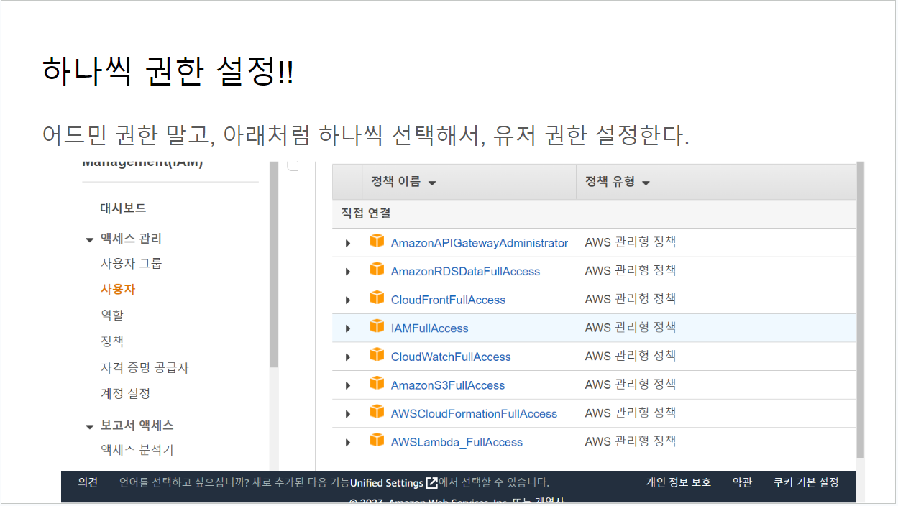
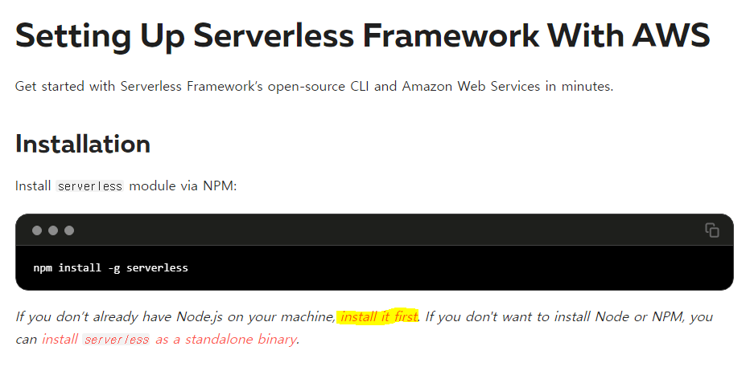
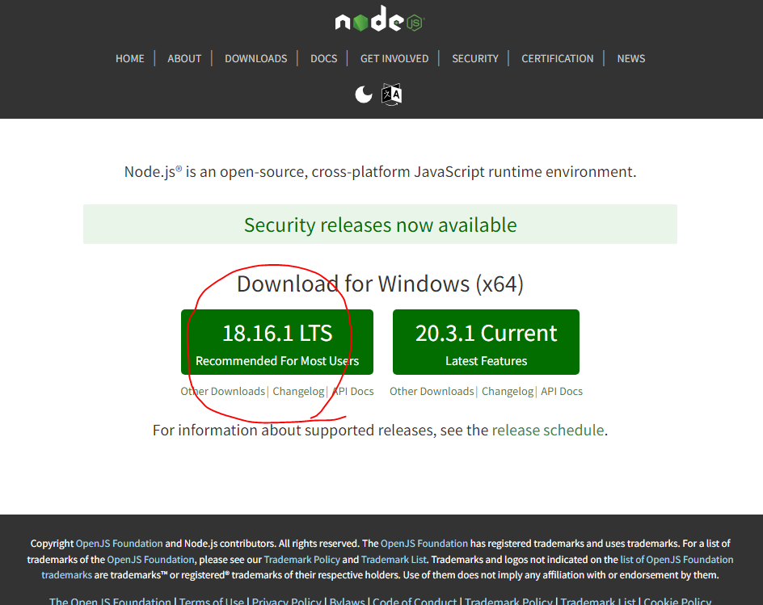
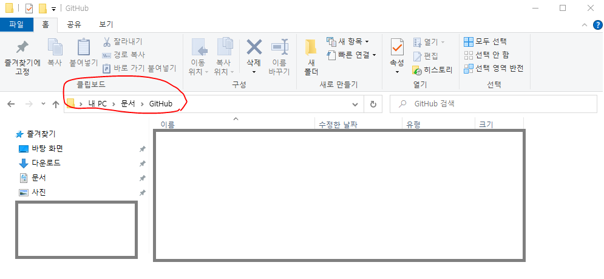
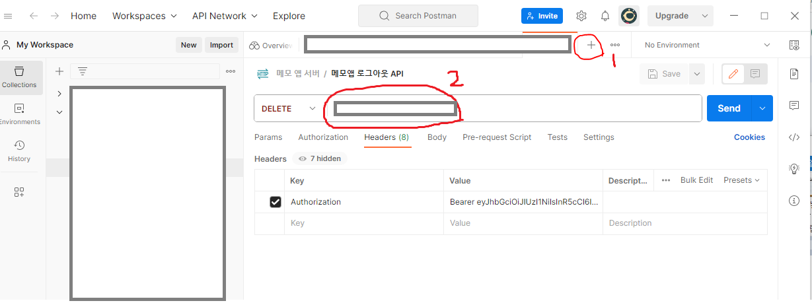
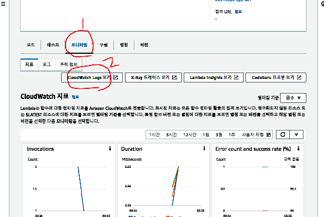
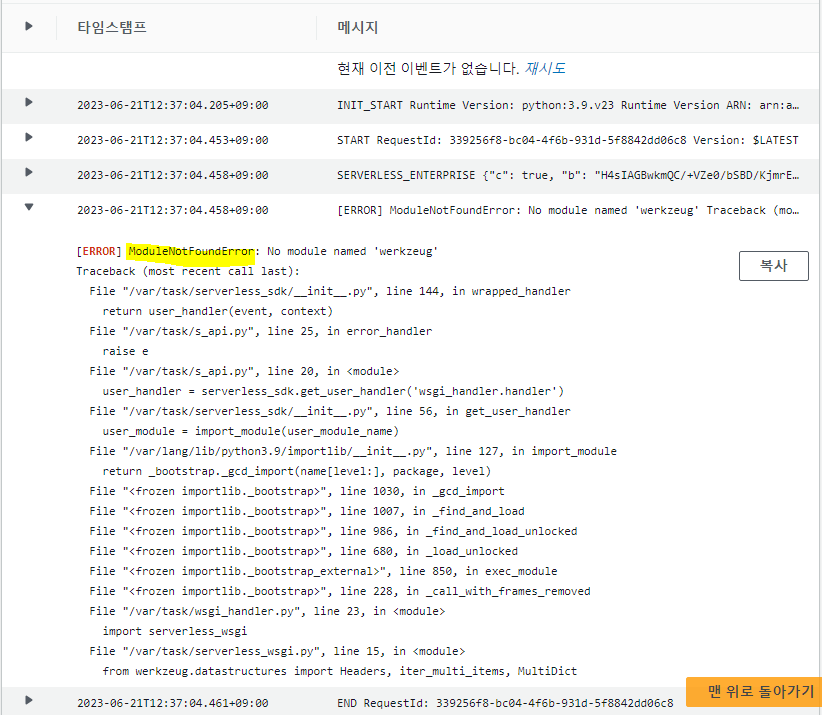

# 6월 21일


## AWS Lamda를 이용한 Serverless Application 설치 및 사용하기 (개발1)
- API Gateway가 rest API 요청을 받아서 람다를 실행하고
- Lambda가 RDS(MySQL), DynamoDB, S3등에 데이터를 처리함
- flask API 서버를 AWS에 배포해서 돌아가도록 만들어야 하는데 이때 serverless framework라는 프로그램이 필요함.
  
## 자동배포를 위한 설정
### 1. AWS Credentials 만들기
- AWS의 IAM으로 이동 : 람다로 배포할 수 있는 권한을 설정 할 수 있다.
- 사용자 추가를 누르고 사용자 이름을 입력
- 권한 옵션 -> 직접 정책 연결 선택
- 권한이 상당히 많으므로 검색해서 필요한 권한을 하나씩 선택해준다.

- 전부 선택했다면 사용자 생성 버튼 누른다
- 생성된 사용자 이름을 클릭
- 보안탭으로 넘어가 액세스 키 만들기를 선택
- 아무거나 선택해도 된다고 하니 로컬 키를 선택
- 액세스 키 생성을 누르면 액세스 키가 생성되는데 여기서 생성되는 키는 잃어버린다면 다시 액세스 키를 만들어야 한다.
- CSV파일을 꼭 다운받아서 저장해놓아야 함.
- 여기서 설정한 유저네임과 액세스 키는 밑의 serverless.com에서 API를 배포할때 이 키를 사용함.

### 2. AWS serverless framework 설치
#### (1) 프로그램 다운로드
- serverless.com 홈페이지로 이동
- 메뉴탭 - docs - get start를 선택

- 인스톨 코드를 복사 해 놓고 먼저 노드를 선택해 다운로드 한다.

- 왼쪽의 프로그램을 다운로드한다.
#### (2) 설치 후 세팅
- 윈도우 파워셸 또는 아나콘다 프롬프트를 실행한다.
- 아까 복사한 인스톨 코드를 붙여넣고 실행한다.
- 잘 설치가 되었다면 프롬프트를 닫아도 된다.

#### (3) serverless.com 홈페이지에서 설정
- 회원가입이 되지 않았다면 회원가입한다.
- (보통 구글 아이디 연동함)
- 연동 후 내 페이지에서 create app을 클릭하고 우리가 만들었던 템플릿을 선택한다.
- 우리는 flask API를 만들었으므로 python flask API를 선택한다
- 배포하려는 앱의 이름을 알아볼 수 있게 적고(임의기입) 만들기를 누른다.

#### (4) 프롬프트에서 확인하기
- 만들기 버튼을 눌렀다면 프롬프트에 붙여넣을 수 있는 명령어가 뜨는데 이걸 복사한다.
- 프롬프트를 열고 깃허브의 리포지토리가 있는 경로로 이동한다.
  - 보통 깃허브 리포지토리 폴더를 열면 한글로 경로가 나오는데 그 부분을 클릭하면 영어로 경로가 뜬다. 이걸 복사하면 된다.
  - 프롬프트에 cd + 복사한 경로 입력
    
- 아까 서버리스홈페이지에서 템플릿을 만들기 눌렀을때 나오는 명령어를 프롬프트에 붙여넣는다. 이때 왠만하면 줄바꿈 명령어(원표시같은거)는 지우고 한 줄로 만들어 준 뒤 붙여넣는다.
- 깃허브 폴더 안에 방금 생성한 템플릿 명으로 된 폴더가 생성되었다면 성공. 
- 하지만 아직 배포가 안된다. 왜냐면 권한이 없기 때문이다.

#### (5) 배포 권한 설정하기
- 서버리스 홈페이지 왼쪽 메뉴 탭의 org 선택
- provider 클릭 -> add 클릭
- AWS IAM에서 만들어둔 유저네임, 액세스키, 시크릿액세스키를 여기에 입력한다.
- 생성하기 버튼 클릭
- 생성 성공

#### (6) 배포 되는지 확인하기
- 아나콘다 프롬프트 실행
- 깃허브의 서버리스 템플릿 폴더로 이동
    ```
    cd C:\Users\405\Documents\GitHub  
    cd aws-recipe-app 
    ```
- 서버 배포 명령어를 입력한다.
    ```
    sls deploy
    ```
- 명령 칠 때마다 템플릿 안에 있는 코드가 AWS로 배포되는것
- 성공 했다면 마지막에 아마존 닷컴으로 끝나는 주소가 하나 뜨는데 이게 돌아가고 있는 서버를 보여줌.

#### (7) VScode 로 확인하기
- VScode 실행 - 파일 - 템플릿폴더 열기
- app.py로 가보면 어떤 경로로 들어갔을때 어떤 내용이 화면에 뜨는지 보여줌.
- 이제 이 폴더에 우리가 만든 소스코드를 옮겨놓으면 우리가 만든 API가 보이게 됨.

#### (8) 오류
- 아나콘타 프롬프터로 디플로이를 실행했을때 실행 완료 후 나온 endpoint 주소를 다시 인터넷 창에 입력했으나 결과가 이렇게 뜸.
```
{"message":"Internal Server Error"} 
```
--->> 디버깅 부분으로 넘어가서 내용 확인하기


### 3.  서버리스 자동배포 위한 VS CODE 설정하기

#### (1) 
- 인터프리터는 람다 앱 (3.10.0)
- app.py에는 간단한 샘플 템플릿이 들어있음.
- 패키지라고 써 있는 파일은 건들지 않는다.
- requirements.txt 파일이 중요함.
- serverless.yml : 서버리스 프레임워크가 가장 먼저 읽는 파일. 필요정보를 바꿔준다. (여기서는 프로바이더의 파이썬 버전을 3.10으로 바꿔주기)

#### (2) requirements.txt >> 중요!!!
- 이 파일은 서버에 어떤 라이브러리를 설치하는지 알려주는 파일.
- 우리 로컬에 설치한 라이브러리를 여기에다가 적어둬야 서버에 설치 할 수 있음.

#### (3) 내가 만든 서버 파일과 폴더를 복사해오기
- app.py의 메인페이지에 있는 내용을 다 지워준다
- 내가 만든 앱 폴더의 파일들을 복사해서 서버리스로 만든 폴더 안으로 복사
- requirements.txt 에 라이브러리 적어줌
- serverless.yml 에서 파이썬 버전을 내가 사용한 버전으로 바꿔줌
- 이제 터미널을 프롬프트로 띄우고 sls deploy 명령어 입력 
또는 serverless deploy 입력

#### (4) 깃허브 이동
- 새 리포지토리 만들기
- 이름은 웬만하면 서버리스 템플릿과 같은 이름으로
- 프라이빗
- 리드미, 깃 이그노어 필요없음 : 이미 폴더에 만들어져있음.

#### (5) 다시 VS CODE
- 터미널이 람다 앱 인 상태 확인
- $ git init
- 수정내용이 많이 뜨면 이걸 깃허브에 푸시하는데 첫번째 푸시만 해줌.
- 커밋만 한 상태로 퍼블리시 브랜치까진 하지 말고 수정사항만 올린 상태로
- $ git branch -M main
- 아무것도 안뜨는거 맞는거임.
- $ git remote add origin https://github.com/내아이디/리포지토리위치
- 역시 아무것도 안뜨는거 맞는거
- $ git push -u origin main

#### (6) 테스트 해보기
- 비주얼코드에서 간단한거 수정해 본 다음에 저장하고
- 터미널에 sls deploy 입력
- 포스트맨에서 엔드포인트 주소 경로 바로 앞에 붙여넣은다음
잘 실행되는지 확인


## 1. 디버깅 하는 방법 
### (1) 포스트맨 실행
- 포스트맨을 실행

- 1번을 클릭해서 새 탭을 열어준다
- 2번에 커서를 놓고 endpoint 주소를 붙여넣고 send버튼을 눌러 실행해본다.
- 밑에 뜨는 결과를 확인한다.

### (2) AWS에서 로그 확인하기
- AWS의 람다 서비스로 이동
- 기본적으로 미국 동부 버지니아 북부를 기준으로 배포가 되므로 지역을 버지나아 북부로 바꾼다
- 화면에 함수관리 버튼이 뜨면 함수관리 버튼을 클릭한다
- 오류가 났던 앱의 이름을 클릭한다
- 모니터링 탭으로 이동
- 클라우드 와치 로그 보기 버튼 클릭

- 로그 스트림탭으로 이동
- 최근 실행한 로그 스트림 클릭
- 여기에 에러가 찍혀있는지 확인하기

- 나는 위와 같은 오류가 발견되었는데, 이것은 서버에 라이브러리가 설치되지 않았다는 의미이다.

### (3) VS code
- 저 라이브러리가 제대로 설치되는지 확인하기 위해 비주얼스튜디오코드로 이동
- 오류가 난 템플릿 폴더를 열어준다
- requirements.txt 확인하기 : 여기에 있는 라이브러리를 AWS에 설치해라 라는 명령어가 입력되어있음. 버전 이름을 지워주고 저장해보기

### (4) 아나콘다 프롬프트
- 다시 아나콘다 프롬프트를 열어준 뒤 깃허브의 템플릿 폴더까지 이동하여 디플로이 실행 명령어 입력
- 실행 명령어 : sls deploy 
- 실행이 완료되면 뜨는 주소를 다시 인터넷 창에서 열어보고 메세지가 잘 뜨는지 확인

#### ==>> 실행이 잘 됨. 디버깅 완료.


# 오늘의 문제점 및 해결방안
- 문제점 :

배포 완료된 템플릿을 보기 위해 인터넷으로 접속했더니 {"message":"Internal Server Error"} 라는 오류가 뜸.

- 문제를 해결하기 위한 디버깅 방법을 배움.
- 내가 사용한 라이브러리를 어디에 잘 적어두는것이 중요하다. 
- 내가 낸 오류의 대부분은 라이브러리의 스펠링이 틀렸거나, 아니면 다른 라이브러리 설치를 명령해서였다.
- 라이브러리를 잘 적어두자!
### 참고
- $ pip freeze를 사용하면 설치된 라이브러리를 알 수 있으나, 이 명령어로는 전체 설치 라이브러리가 나오기때문에 프로젝트를 위해 설치한 라이브러리만 따로 생각해내기가 쉽지 않음.
- 그냥 라이브러리 사용한걸 잘 적어두자.


