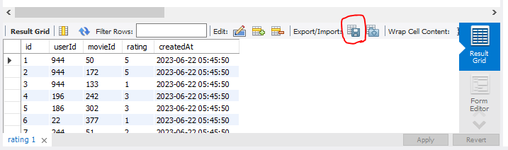
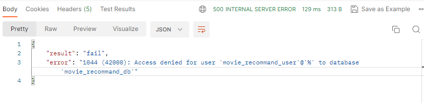
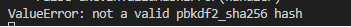

# 6월 22일

## AWS Lambda를 이용한 Serverless Application 개발 2
### 1. 배포 복습함.

### 2. 배포를 서울지역으로 바꾸는 방법
#### (1) AWS 콘솔
- AWS 콘솔에 접속해서 지역을 아시아태평양 - 서울 로 바꿈

#### (2) 서버리스 템플릿 앱(vscode) 열기
- serverless.yml 파일의 provider 부분을 다음과 같이 바꾸기
    ```
    
    org: hyeeyh             (-이 부분 삭제)
    app: aws-memo-app       (-이 부분 삭제)
    service: aws-memo-app
    
    provider:
    name: aws
    runtime: python3.10    (+ 버전 바꿈)
    region : ap-northeast-2  (+추가내용)

    ```
- 이렇게만 바꾸고 서버에 배포하면 오류가 난다. 서버리스의 권한을 org에 주었기 때문임.
- 이 권한을 컴퓨터에 설정하면 된다.
    ```
    # < 컴퓨터에 설정하는 방법 >
    # - serverless framesork aws credentials 검색

    # - AWS - Config Credentials 클릭

    # - 맨 위 코드를 복사 ( 기본틀 )
    # $ serverless config credentials --provider aws --key 1234 --secret 5678

    # - 내 IAM으로 받은 키로 바꾸기
    # $ serverless config credentials --provider aws --key (나의 키) --secret (내 시크릿키)

    # 위 키를 vscode 의 터미널에 입력해서 실행하면 된다.
    ```
- 권한을 설정해주고 다시 $ sls deploy (배포명령어)
- 지역을 바꾸면 엔드포인트 주소도 바뀌므로 다시 그 주소로 잘 배포되었는지 확인한다.


### 3. SQL 데이터를 CSV파일로 변환하는 방법
- 코드를 쓰는 방법도 있으나, 오류가 자주나서 찾은 가장 간편한 방법이 있음

- 빨간 원 안의 아이콘 클릭
- 원하는 경로에 파일 이름 써서 저장하기 누르기


# 오늘의 문제점 및 해결책
## 1. 포스트맨
### (1) API 테스트 시 데이터베이스에 접속 권한이 없다는 에러 메세지가 뜸.

- 데이터베이스에 접속 할 수 있는 유저에게 권한을 주는 쿼리문을 작성해서 실행할 때에는 항상 admin 계정에서 실행해야 접속 오류가 나지 않는다.

### (2) 로그인 API 테스트시 에러

- 위 오류가 나는 이유는 테이블에 insert한 데이터의 형식때문이다.
- 테이블에는 패스워드 컬럼이 있고 문자형식의 비밀번호가 무작위로 들어가있었음.
- 비번을 암호화해주는 라이브러리가 이 문자열 형식을 이미 암호화가 된 것이라고 인식 했기 때문임.
- 숫자만으로 비번을 입력했을때 정상적으로 실행되었다.
    ```
    # app.config['JWT_SECRET_KEY'] = 'super-secret' # HS256
    # ValueError: not a valid pbkdf2_sha256 hash 오류날때 
    # 위 코드를 api = Api(app)위에 적으면 오류가 없어진다고 함.
    ```

## 2. 
