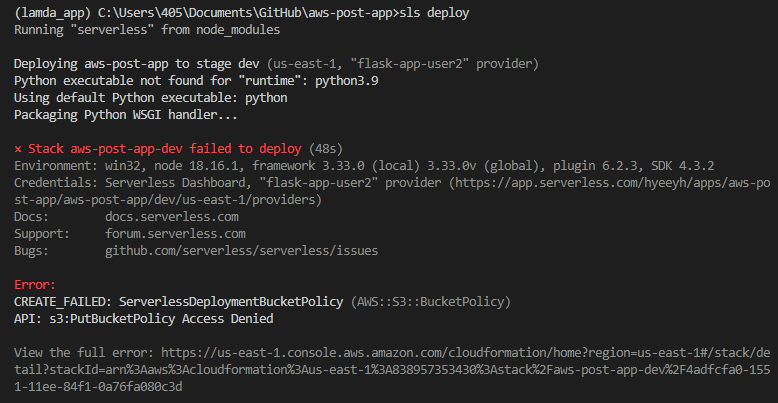
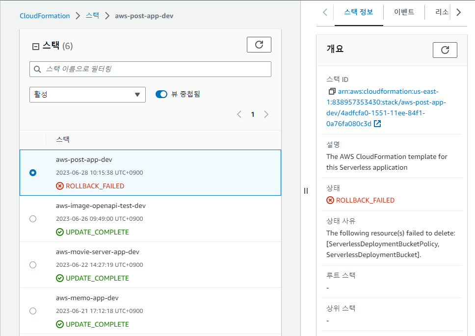

# 6월 28일

## 사진SNS포스팅 서비스 개발 해설
### 개발 순서 간단 정리
1. 화면 기획서 보고 설계 어떻게 할지 생각해본다
2. 데이터베이스에서 테이블부터 설계
3. 서버리스에 프로젝트 만들기
4. 비주얼코드로 프로젝트 열어준 뒤 인터프리터를 바꾸고 일단 배포
5. 정상배포라면 다음단계로, 오류난다면 프로젝트를 다시 만들거나 오류난 부분을 수정
6. 깃허브 리포지토리 만들고 푸시 한번 해주기
7. 비주얼코드로 간단하게 개발하기 (ex : 회원가입페이지만 만들기)
8. 중간 중간 커밋 해 주기. 커밋은 바꾸는게 있을때마다 해주면 나중에 오류 보고 고치는데 도움이 된다
9. 배포해서 테스트해보고 잘 되면 푸시
10. 자동배포 설정하고 잘 돌아가는지 확인. 오류가 난다면 오류 수정해주기
11. 비주얼코드로 이동해서 본격적인 개발

## AWS 람다로 자동 배포하기
### 필요한 준비
- 서버리스에서 제공하는 서버리스 액세스 키
- AWS에서 제공하는 IAM키(플라크스 유저라고 이름붙인 키의 액세스키, 시크릿액세스키)

#### 서버리스에서 액세스 키 발급받기
- 서버리스에 로그인
- 메뉴의 org 를 선택 - access key 탭에 들어가 add버튼 눌러 새 키 받기
- 새 키의 이름을 적고 create를 누르면 액세스키가 발급되는데 한번만 보여주니 보여줄때 복사해서 잊어버리지 않게 저장해둔다.


### 깃허브 설정
- 깃허브에서 이번 프로젝트를 올린 리포지토리로 이동
- 리포지토리의 settings 탭으로 이동
- 왼쪽 메뉴의 Security 탭의 Secrets and variables 클릭 - Actions 선택
- New repository secret을 선택해서 키를 3개 만들기
1. 첫번째 키
   - 서버리스에서 발급받은 키
   - 이름 탭에 SERVERLESS_ACCESS_KEY
   - 내용 탭에 발급받은 키를 넣는다
2. 두번째 키
   - AWS IAM 에서 발급받은 액세스 키
   - 이름 탭에 AWS_ACCESS_KEY_ID
   - 내용 탭에 액세스 키를 넣는다
3. 세번쨰 키
   - AWS IAM 에서 발급받은 시크릿 액세스 키
   - 이름 탭에 AWS_SECRET_ACCESS_KEY
   - 내용 탭에 시크릿 액세스 키를 넣는다
4. 유의사항
   - 키 값을 입력할 때 오타가 있는지, 띄어쓰기가 더 남아있는지, 엔터를 치지는 않았는지 확인한다. 엔터 한번으로 오류가 날 수 있다.

#### 설정하기
- 키를 다 만들었다면 리포지토리의 액션즈(Actions)로 이동
- set up workflow yourself 클릭
- 다음의 코드를 그대로 붙여넣는다
    ```
    name: Deploy sls app

    on: 
    push:
        branches:
        - main

    jobs:     
    deploy:
        runs-on: ubuntu-latest (이 컴퓨터 사용해)
        env:
        SERVERLESS_ACCESS_KEY: ${{ secrets.SERVERLESS_ACCESS_KEY }}
        AWS_ACCESS_KEY_ID: ${{ secrets.AWS_ACCESS_KEY_ID }}
        AWS_SECRET_ACCESS_KEY: ${{ secrets.AWS_SECRET_ACCESS_KEY }}
        steps:
        - uses: actions/checkout@v3
        - name: install-python
        uses: actions/setup-python@v4
        with:
            python-version: '3.10'
        - name: install serverless
        run: npm i -g serverless
        - run: serverless plugin install -n serverless-wsgi
        - name: severless deploy
        run: sls deploy --verbose --force
    ```

## 오토태깅 기능 넣기
- 내용이 길고 복잡하므로 프로젝트의 내용을 확인
- 프로젝트 이름 : aws-post-app
- 관련 파일 : post.py

### 오토 태깅 기능 사용시 유의사항
#### 유의사항 1
- rekognition의 기능은 us-east-1지역에서만 사용 가능
- 그러므로 버킷을 다른지역으로 만들면 오류가 난다.
- 버킷을 us-east-1에 만들어야한다.
- 버킷을 바꾸어줬다면 config.py 안의 내용도 바꿔줘야한다.

#### 유의사항 2 - 응답시간 늘리기
- 오토태깅 등 기능을 추가다하 보면 응답시간이 길어짐
- 처리하는 시간이 길어지다보면 서버에서 자동으로 연결을 끊어버리는데 이 처리시간을 길게 줄 수 있음.
1. AWS 람다 에서 수정하기
   - 함수 선택
   - 구성 탭의 일반 구성 선택
   - 제한시간 수정할 수 있는 부분이 있음.
2. vs code로 수정하기
   - serverless.yml 파일에서 내용 수정
        ```
        provider:
            name: aws
            runtime: python3.10
            region : ap-northeast-2
            timeout : 70       # + 타임아웃을 추가해줌 -> 제한시간 70초라는 얘기

        ```


# 오늘의 문제점 및 해결방안
### 문제점 1
- 버킷 오류가 있다는 에러 메세지를 확인

- AWS에 가서 확인을 해 보았더니 다음과 같은 알림을 볼 수 있음


### 해결방안 1
- AWS에서 IAM키가 퍼블릭으로 노출되었을때 자동으로 감지해서 키의 권한을 닫아버리는 AWSCompromisedKeyQuarantineV2 권한 정책이 있음.
- 며칠 전 깃허브에 프로젝트의 내용을 올리면서 퍼블릭으로 리포지토리를 만들어 올렸을때 키가 노출되었다는 메일을 받고 새 액세스 키를 받아 전환하였는데, 키를 전환하였어도 AWSCompromisedKeyQuarantineV2 권한 정책으로 이미 사용을 한번 막아버려서 나는 오류라고 함.
1. AWSCompromisedKeyQuarantineV2 의 권한을 삭제
2. 서버리스의 홈페이지에 로그인 해 org의 provider에서 전환한 새 액세스키를 등록한 뒤 기존의 액세스 키와 시크릿 키를 삭제
3. 새 프로젝트를 만들어 배포

### 문제점 2
- 깃허브에 푸시를 하려고 하니 다음과 같은 메세지가 뜸.
    ```
    git push -u origin main
    error: src refspec main does not match any
    ```

### 해결방안 2
- 푸시할 내용이 없다는 알림이었음. 커밋을 한 뒤 푸시하자 제대로 동작함.


### 문제점 3
- 포스트맨에서 테스트 중 포린키가 걸려있는 포스트를 삭제하려고했더니 삭제할 수 없다고 뜸.
- --->> 해결방법 아직 못찾음