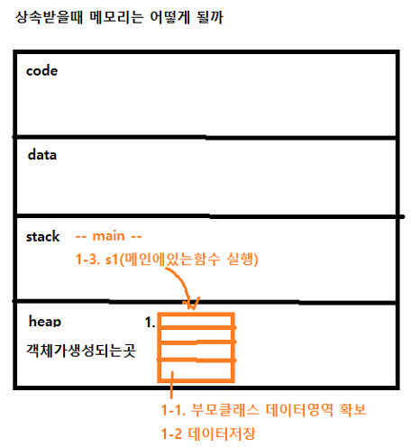
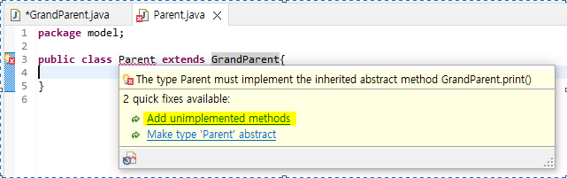

# 7월 4일

## 자바 스크립트 문법3
###  알아두기
#### 1. 차이점
- 메소드 오버로드:
- 매소드 오버라이딩 :
#### 2. 차이점
- super. : 부모를 말함. 부모클래스에서 가져왔다는걸 알려주는 것. 상속받은 클래스를 알려줌.
- this. : 지금 이(현재) 클래스를 말함.

#### private으로 되어있는 객체들의 데이터를 입력받는 3가지 방법
- 생성자 만들기 : source - gerate constructor using fields
- getter setter 함수 이용하기 : source - gerate getter and setter
- private을 public으로 만들기

#### (참고) 컴퓨터의 코드 실행 순서
- 메인 함수 실행  
- -> 함수가 상속받은게 있다면 부모 클래스로 감 
- -> 그 부모클래스가 또 상속받은게 있다면 또 GrandParent로 감 
- -> 거기서 변수가 있다면 heap에 변수 저장할 데이터 공간을 잡음. 
- -> 이제 parent로 가서 heap에 부모클래스 변수 저장할 공간을 만듦 
- -> child클래스의 변수를 저장할 공간을 만듦(heap).
- 
- -> 차일드의 생성자 코드 실행
- -> 페어런트의 수퍼의 생성자를 호출
- -> 그랜드 페어런트의 생성자를 호출. 변수 저장
- -> 다시 돌아와서 차일드의 변수 저장


### 상속2
- 참고 : 상속받을때 메모리


### 상속의 대물림(여러번 상속)
- 상속은 여러번 할 수 있지만
- **클래스는 하나의 클래스만 상속 받을 수 있다**
- GrandParent -> Parent -> Child 이렇게 일렬로 상속도 가능하고
- Child1 -> Parent <- Child2 이렇게 한개의 클래스가 여러개의 상속자를 데리고 있을 수도 있다.


### 추상 클래스 Abstract
- 추상 클래스는
- 메소드의 이름만 있고
- 내용이 아직 정해지지 않은 메소드가 존재한다.
#### 이유	
- 왜 이렇게 만들까?
- 상속받아서 이 함수 이름을 이용해서 오버라이딩 하기 위해
- 함수 이름을 임의로 정하지 못하도록 미리 정해주는것!
```
(예시)
---------------------------------------
< GrandParent class >
public abstract class GrandParent {
    public abstract void print();
}
--------------------------------------
< Parent class>
package model;

public class Parent extends GrandParent{
    String job;

    @Override
	public void print() {
		// TODO Auto-generated method stub
		System.out.println(name);
		System.out.println(age);
		System.out.println(job);
	}
}
--------------------------------------
```
- grandparent 에서 abstract으로 함수를 만들었는데 그 클래스를 상속받아 다른 클래스를 만들었을경우 다음과 같이 경고문이 뜬다.
- 
- 안 만든 함수 있다. 만들어라 라고 경고하는것.
- 클릭하면 만들어야 하는 함수가 바로 작성된다.

### 문자열 String
#### 문자열 데이터 다루기
```
        // 1.
		// 문자열 생성 방법 2가지
		// 1)
		String str1 = "Hello";
		// 2)
		String str2 = new String("Hello");
		
		System.out.println(str1);
		System.out.println(str2);
		
		
		// 2.
		// 아래 두개는 클래스 아닌데 클래스처럼 쓰고 있음
		int num1 = 3;
		double num2 = 3.5;
		
		//int를 클래스로 만든것 사용해보기
		Integer num3 = 3;
		// Integer num4 = new Integer(3); // 이렇게는 안써짐
		
		System.out.println(num1);
		System.out.println(num2);
		
		double num4 = 3.6;
		Double num5 = 3.7; // -- 두개 다 가능
		
		
		// 3.
		// 문자열을 붙이는 방법
		String str3 = "Bye";
		
		System.out.println(str1 +" "+str3);
		
		
		// 4.
		// 4-1.
		// *문자열을 숫자로 바꾸는 방법*
		String str4 = "317";
		
		// 방법1.
		int a = Integer.valueOf(str4).intValue();
		System.out.println(a + 100); // 숫자인지 확인하려면 계산이 되는지 확인해본다
		System.out.println(str4 + 100); //문자라면 숫자가 옆에 붙어서 나온다
		
		// 방법2.
		a = Integer.parseInt(str4);
		System.out.println(a + 100);
		System.out.println(str4 + 100);
		
		
		// 4-2.
		String str5 = "3.14";
		double b = Double.valueOf(str5).doubleValue();
		b = Double.parseDouble(str5);
		
		System.out.println(b + 100);
		System.out.println(str5 + 100);


		// 5. 
		// 숫자를 문자로 바꾸는 방법
		
		// 방법1)
		int k = 365;
		// " " + k;     --> 가장 쉬운 방법
		
		System.out.println(" " + k);
		System.out.println(k + " ");
		
		// 방법2)
		String data = String.valueOf(k);
		
		// 방법3)
		data = Integer.toString(k);
		
		
		
		// 6.
		// 문자열 붙여주는 함수
		str1 = "Hello";
		str2 = "bye";
		
		String result = str1.concat(str2);
		
		System.out.println(result);
		
		
		
		// 7.
		// 문자열의 길이(개수) 구하는 함수
		str1.length();
		
		System.out.println( str1.length() );
		
		
	
		// 8.
		// 문자열 쪼개기
		str3 = "안녕하세요 반갑습니다. 식사하셨어요?";
		String[] dataArr = str3.split(" ");
		
		for(int i = 0; i < dataArr.length; i++) {
			System.out.println( dataArr[i] );   }
		
		
		
		// 9.
		// 문자열 슬라이싱
		// 1) 처음부터 끝까지 가져오기
		str3.substring(0);
		
		System.out.println( str3.substring(0) );
		
		// 2) 5번째 글자부터 끝까지 가져오기
		System.out.println( str3.substring(4) );
		
		// 3) 2번째 글자부터 5번째 글자까지
		System.out.println( str3.substring(1, 4+1) );
		
		
		
		// 10.
		// 문자열이 같은지 다른지 확인하기 --> equals 함수
		// -- 두 문자열이 같은지를 확인할때에는 '==' -> 이 기호를 사용하면 안된다. 이건 숫자만!!
		String email1 = "  aaa@naver.com  " ;
		String email2 = "aaa@naver.com" ;
		
		email1.equals(email2);
		
		System.out.println( email1.equals(email2) );
		
		
		
		// 11.
		// 공백 제거하기 함수
		email1.strip();
		
		System.out.println( email1.strip() );
		
		System.out.println( email1.strip().equals(email2) );
		
		
		
		// 12.
		// 문자열 대문자/소문자로 바꾸기
		email2.toUpperCase();   // 대문자로 변환
		email2.toLowerCase();   // 소문자로 변환
		
		System.out.println( email2.toUpperCase() );
		System.out.println( email2.toLowerCase() );
		
		
		
		// 13.
		// 문자열의 대소관계 파악하는 함수 --> compareTo
		// 0이면 두 문자열은 같다
		// 음수면 작다
		// 양수면 크다
		
		str1 = "apple";
		str2 = "banana";
		str3 = "candy";
		str4 = "Apple";
		
		str1.compareTo(str2);
		
		System.out.println( str1.compareTo(str2) ); // b가 더 큼
		System.out.println( str1.compareTo(str3) ); // c가 더 큼
		// 마이너스가 나오면 더 작다는 뜻.
		
		System.out.println( str2.compareTo(str1) );
		System.out.println( str1.compareTo(str4) ); //소문자가 더큼
		// 플러스가 나오면 더 크다는 뜻.
		
		System.out.println( str1.compareTo(str4.toLowerCase()) ); // 같음
		// 0이 나오면 같다는 뜻.
		
		
		
		// 14.
		// email2 안에 '@'가 들어있는지 확인하기
		email2.contains("@");
		System.out.println( email2.contains("@") );    // true
		System.out.println( email2.contains("bbb") );  // false
		
		
		
		// 15.
		// email2 안에 '@'가 어디에 있나? (인덱스를 알고싶을때)
		email2.indexOf("@");
		System.out.println( email2.indexOf("@") ); 
		
		
		
		// 16.
		// 공백 제거하기 -- 중간에 있는 공백을 제거하는거 아님.
		email1.trim();
		System.out.println( email1.trim() ); 
		
		String str6 = "   Hello World~  ";
		System.out.println( str6.trim() );
```


## 데이터 스트럭쳐
### ArrayList
- Array (배열) 의 단점 :
- 생성할때 무조건 개수를 정해놓고 생성해야한다.
- (예시)
    ```
    String[] nameArr = new String[5];
    ```
- 위의 배열은 정해진 개수 이상으로는 데이터 추가 불가!
- 따라서, 개수 제한 없이 데이터를 마음대로 
- 추가할 수도 있고, 삭제할 수도 있는 ArrayList 를 이용한다.

#### ArrayList 기본 사용법
```
        // 1. 
		// ArrayList
		
		// 데이터가 아무것도 없는, 비어있는 리스트 생성
		// 파이썬 : my_list = []   --> 이런 형태.
		ArrayList<String> nameList = new ArrayList<>();
			//--> 문자열데이터를 저장할 리스트를 만들거다
		
		// 'ArrayList<String> nameList = new ArrayList<>();'  의  '<String>' 과
		// 'nameList.add("홍길동");'  의  '("홍길동")'는 데이터타입이 일치해야한다.
		
		// 1-1.
		// 데이터 넣기 C
		nameList.add("홍길동");
		nameList.add("김나나");
		nameList.add("철수");
		
		// 1-2.
		// 데이터 가져오기 R
		nameList.get(1);
		System.out.println(  nameList.get(1)  );
		
		// 1-3.
		// 데이터 변경 U
		nameList.set(1, "Mike");
		System.out.println(  nameList.get(1)  );
		
		// 1-4.
		// 데이터 삭제 D
		nameList.remove(0);
		
		


		// 2.
		// 전체데이터 루프 도는 방법 -- 프린트
		// for each 반복문
		
		// 2-1.
		// 오리지널 for 방식
		for(int i=0; i< nameList.size(); i++) {
			System.out.println(  nameList.get(i)  );
		}


		// 2-2.
		// ***for each 반복문***
		// 파이썬의 for 같은 반복문
		for( String name : nameList ) { 
            // nameList에 있는것들 뽑아서 name(변수)에 저장해달라
			System.out.println(  name  );  } 
		
		
		
		// 3.
		// ArrayList에 데이터가 몇개 있는지 확인하기
		nameList.size();
		System.out.println(  nameList.size()  );
		
		
		
		// 4.
		// 데이터가 비어있는지 확인하는 방법
		nameList.isEmpty();
		System.out.println(  nameList.isEmpty()  );  
                //--true(비어있음), false로 나옴.
		
		
		
		// 5.
		// 데이터를 모두 삭제하는 함수
		nameList.clear();
		System.out.println(  nameList.isEmpty()  );  
                    //-- true로 나옴.

```

### HashMap
- Map은 파이썬의 딕셔너리와 비슷한 데이터 스트럭쳐로서
- key, value의 쌍으로 저장한다.
    ```
    //           키      밸류
        HashMap<String, String> phoneMap = new HashMap<>();
    ```
#### HashMap 사용하기
```
        // 1.
		// 데이터 저장
		// (딕셔너리에는 순서없듯 이것도 마찬가지)
		// ((유의)) 문자열로 하겠다고 선언했다면, 숫자도 문자로 입력해야한다
		// 데이터 타입에 괭장히 까다로운 프로그램이다
		phoneMap.put("model", "iphone 12");
		phoneMap.put("year", "2021");
		phoneMap.put("color", "red");
		
		
		// 2.
		// 데이터 가져오기
		String value = phoneMap.get("color");
		System.out.println(  value  );
		
		
		// 3.
		// 데이터 값 변경하기
		phoneMap.replace("year", "2022");
		System.out.println(  phoneMap.get("year")  );
		
		
		// 4.
		// 데이터 삭제하기
		phoneMap.remove("year");
		
		
		// 5.
		// 전체 데이터 프린트
		
		// 5-1.
		// 오리지널 for 방식 --> 이상함. 딕셔너리엔 인덱스 없음. 안된다!!
		for(int i = 0; i < phoneMap.size(); i++) {
			System.out.println(   phoneMap.get(i)   );  } 
		
		// 5-2.
		// 오리지날 for 루프
		// Object : 자바의 최상위클래스. 모든 데이터타입은 이 클래스를 상속받아 사용. 모든 타입을 커버
		// 배열(toArray)이니까 []로 가져옴.
		Object[] values = phoneMap.values().toArray();
		for(int i = 0; i < values.length; i++) {
			System.out.println(   values[i]   );  }
		
		// 5-3.
		// for each 방법
		for( Object data : values ) {
			System.out.println(   data   );  }
		
		
		// 6.
		// 전체 데이터 지우기
		phoneMap.clear();
		
		
		// 7.
		// 데이터 있는지 없는지 확인하기
		phoneMap.isEmpty();
		
		if( phoneMap.isEmpty() ) {System.out.println( "데이터 없음" );}
		else {  System.out.println( "데이터 있음" );  }

```

## Try - Catch - finally
- 에러가 날 만한 부분에 사용해서 어디서 에러가 나는지 확인하기 위해 사용
- 코드 구조
    ```
    try {  } //에러가 날 만한 코드가 있는 부분을 try로 둘러싼다.
    catch(Exception e) {  } // try 부분에서 에러가 발생하면 원래는 프로그램이 종료된다.
                            // 하지만 try-catch를 이용하면
                            // catch에서 프로그램종료 없이 에러를 처리 해 줄 수 있다.
    finally {}  // try에서 정상 수행을 했든
                // catch에서 에러가 발생 했든
                // 무조건 finally에 있는 코드는 실행해라 
    ```
- 사용 예시
    ```
        try { 
            s1.name = "홍길동";
            System.out.println(  s1.name  );
            s1.subjectList.add("자바");
            }
        catch(Exception e) { 
            System.out.println( "에러가 발생" );
            System.out.println( e.toString() );
                            } 
            finally { System.out.println( "finally 실행됨" ); }
    ```

#### @ 중요 에러 메세지
```
< 코드 예시>
# Main class ----------------------

import model.Student;
public class Main {

	public static void main(String[] args) {

	Student s1 = new Student();
		
    s1.name = "홍길동";
    System.out.println(  s1.name  );
	
    s1.subjectList.add("자바");
    }
}    

# Student class --------------------------

package model;
import java.util.ArrayList;

public class Student {
	
	public String name;
	public ArrayList<String> subjectList
}    
```
- 위 상황에서 코드를 실행시키면 에러 메세지가 뜸.
- java.lang.NullPointerException: Cannot invoke "java.util.ArrayList.add(Object)" because "s1.subjectList" is null
- '메모리에 가리켰는데(NullPointer - 포인터로 가르켰더니 없다) 메모리 안에 아무것도 없다' 는 의미
- ArrayList는 클래스. 단순히 메인 클래스에서's1.subjectList.add("자바");' 라고 명을 내리면 컴퓨터는 Student class 로 이동하여 명령을 수행하는데, Student class에는 subjectList라는 변수만 있는것이고, new가 없기때문에(생성자를 안만들었기때문에) 이것에 대한 메모리는 생성이 된 적이 없는것.
- 요약 : 객체 생성 안하고 뭔가 작업을 하려고 한 것이다
- 해결방법 : 뭘 안만들었는지 찾아서 객체를 생성 해 주면 된다.
    ```
    <해결방법>
    # Student class ---------------
    package model;
    import java.util.ArrayList;

    public class Student {
        
        public String name;
        public ArrayList<String> subjectList = new  ArrayList<>(); // 바로 객체생성하기
        
        // 또는
        // 생성자 만들기
        // public Student(){ subjectList = new  ArrayList<>(); }
    }
    ```


