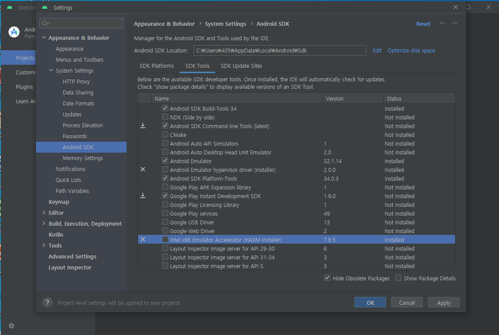
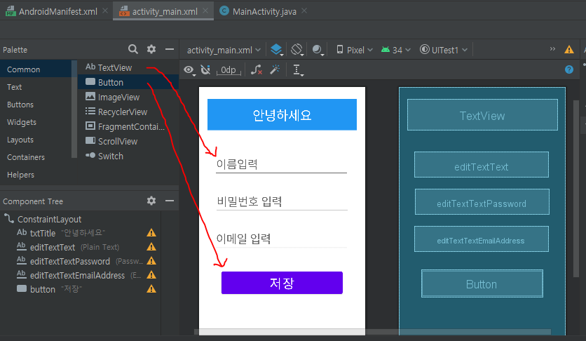
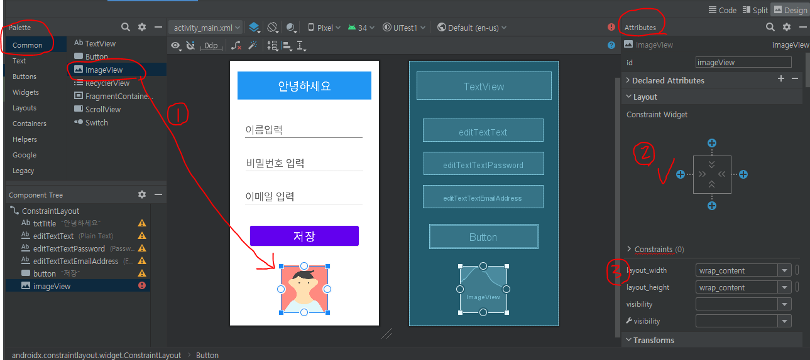
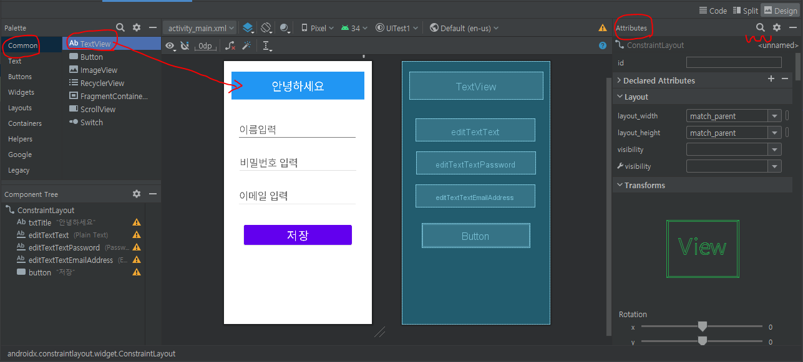
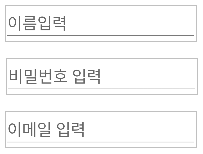

# 7월 5일

## 안드로이드 스튜디오
### 안드로이드 스튜디오 설치
- 안드로이드 스튜디오 홈페이지에서 다운로드 후 설치
- 다운로드 페이지 : https://developer.android.com/studio
- 소프트웨어 SDK : 안드로이드 플랫폼 구축도구 세트를 말함.

### 안드로이드 스튜디오 환경설정하기
- 설치가 끝난 화면에서 more action 클릭
- sdk manager 클릭
- 아래와 같이 체크하고 apply 눌러서 설치하기

## 안드로이드 스튜디오 사용하기 1
- file - new - new project 클릭해서 새 프로젝트 만들기
- 종류는 no activity로 해서 만들기
- 프로젝트 이름을 적어준다
- 패키지 네임은 도메인 주소를 거꾸로 적은것 이다. "com.***.프로젝트이름" 순으로 적혀있는데 여기서 가운데 별표 세개 있는 자리에 자신의 아이디를 적어주면 유니크한 이름이 되어 중복을 피할 수 있다.
#### 프로젝트 구성 파일 간단 설명
- Gradle Script : 이 폴더 안의 'build gradle(module:app)'에 라이브러리를 적어주면 설치해준다.
- Manifests : 아이콘, 프로젝트 이름 등을 바꿀 수 있음.
- Java : 로직 코드를 작성하는곳
- res : 리소스를 모아놓은 폴더. 이미지, 음악파일, 동영상파일 등을 여기에 넣어두고 사용한다

### 개발 순서
1. 액티비티 먼저 만들기
   - java폴더 오른쪽클릭 - znew - activity - empty activity 선택
   - MainActivity : 로직파일. 자바에 생성됨
   - activity_main : 화면기획파일. res의 layout폴더가 만들어지고 그 안에 생성됨.
2. 매니페스트 파일 수정하기
3. 화면 기획하기
4. 로직 기획하기
- 화면기획(XML)과 로직기획(JAVA)은 쌍으로 움직인다.
- 하나의 화면과 로직을 Activity 라고 한다.

#### 화면에 이미지를 배치하는 방법
- activity_main 파일로 이동.
- 
- 위 화면에서 왼쪽의 필요한 기능들을 클릭해서 화면에 끌어와 배치할 수 있음.
- 이미지를 배치하고싶으면 이미지를 클릭 후 드래그
- Attribute에서 이미지 위치와 크기 등을 수정 할 수 있음.
- 
- 1번처럼 드래그 해서 이미지를 가져온 뒤 attribute로 이동하여 2번의 플러스 모양으로 되어있는 버튼을 눌러 화면에서 위치를 고정할 수 있고, 고정 위치를 조정해서 간격을 맞출수도 있다. 3번에서는 이미지와 화면 모서리 사이의 간격을 조절 할 수 있는데(= 마진(margin). 마진을 조절한다), 2번에서 간격을 고정해놨다면 3번에서 이미지 크기를 키우더라도 모양이 안바뀔 수 있으니 이미지 크기를 조절 한 후 간격을 고정하는것이 좋다.
- 2번에서 플러스표시의 버튼을 3개이상 누르지 않으면 오류가 뜨니 주의하기

#### 화면에 문자를 배치하는 방법
- activity_main 파일로 이동.

- 이미지 마진을 맞추고 사이즈를 조절하는 것은 텍스트도 동일
- 텍스트박스의 사이즈는 이미지 크기 조절하는것과 같지만, 텍스트 자체의 크기를 조절하고 싶으면 attribute의 검색창(돋보기모양 아이콘)을 눌러 검색해서 조절하는 편이 빠르다.
- 아래로 내리다보면 여러 수정 옵션들을 볼 수 있는데 기능이 많아서 스크롤을 내려 조절하는 것 보다 검색하는게 빠르다
- 텍스트 박스를 화면에 배치한 뒤 검색하여 원하는대로 수정하자
- text : 텍스트 내용 수정할때 여기에 적어줌
- textcolor : 텍스트 색깔 변경
- textsize : 글자 크기 변경
- (텍스트박스 누른 상태에서) background : 텍스트박스의 색깔 변경
- palette 에서 text를 선택한 뒤 password 버튼를 끌어와 비번입력 칸도 만들 수 있고, email 버튼을 끌어와 이메일 입력 칸도 만들 수 있다.
- 비번과 이메일 버튼을 배치하면 유저에게 비번과 이메일을 입력받을 수 있는데, 이때 hint 기능을 사용하여 텍스트를 입력하면 화면에는 개발자가 입력한 내용이 뜨지만, 유저가 탭하면 입력창으로 바뀐다.
- (예시) 개발자가 입력
- 
- 하지만 칸을 클릭하면 유저가 입력할 수 있는 창으로 변하면서 키보드가 나타난다.

