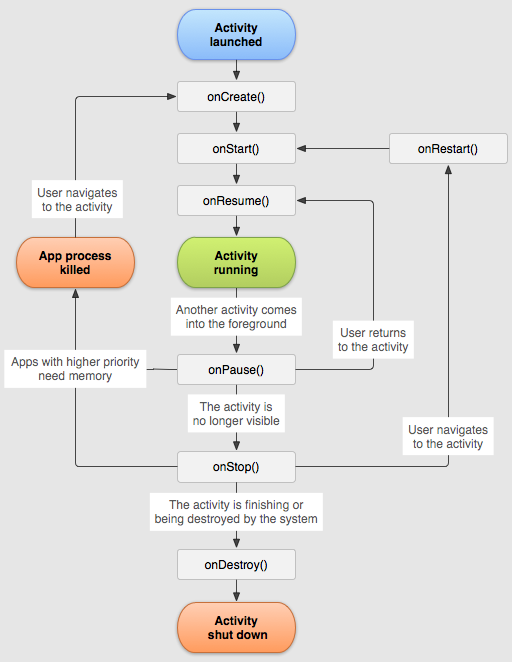

# 7월 10일 

## 안드로이드 스튜디오 사용하기 4

### 여러개의 액티비티 만들기 
- 안드로이드의 최소 개발단위가 액티비티 
- 액티비티의 수명 주기를 말함
- 아이콘을 누르는 순간
- 앱을 실행하면 안드로이드의 메니페스트 파일에 액션 메인이라는 액티비티가 실행됨.
- 액티비티가 화면에 나타남 다른 버튼을 누르면 그 다음 액티비티가 나타남. 버튼을 누르면 또 그다음 액티비티가 나타남...
- back 버튼을 누르면 내가 보는 화면이 종료되어야 함
- 생겼다가 없어지는 것을 액티비티의 수명 주기라고 함.
- 홈 버튼을 누르는것도 액티비티 : 홈버튼은 액티비티 종료가 아닌 일시정지임.

### 액티비티의 라이프 사이클

- 액티비티 클래스에는 6가지 종류가 존재함.
- onCreate(), onStart(), onResume(), onPause(), onStop(), onDestroy()
- 프레임워크를 배운다는 것은 이 함수들을 언제 쓰는것인지 배운다는 것.
- 
#### onCreate()
- 시스템이 먼저 활동을 생성할 때 실행되는 것으로, 필수적으로 구현해야 합니다. 활동이 생성되면 생성됨 상태가 된다.
- 메서드에서 활동의 전체 수명 주기 동안 한 번만 발생해야 하는 기본 애플리케이션 시작 로직을 실행
- onCreate() 메서드가 실행을 완료하면 시작됨 상태가 되고, 시스템이 연달아 onStart()와 onResume() 메서드를 호출

#### onStart()
- 활동이 시작됨 상태에 들어가면 시스템은 이 콜백을 호출
-  onStart()가 호출되면 활동이 사용자에게 표시되고, 앱은 활동을 포그라운드에 보내 상호작용할 수 있도록 준비. 예를 들어 이 메서드에서 앱이 UI를 관리하는 코드를 초기화
- onStart() 메서드는 매우 빠르게 완료되고, 생성됨 상태와 마찬가지로 활동은 시작됨 상태에 머무르지 않습니다. 이 콜백이 완료되면 활동이 재개됨 상태에 들어가고, 시스템이 onResume() 메서드를 호출

#### onResume()
- 활동이 재개됨 상태에 들어가면 포그라운드에 표시되고 시스템이 onResume() 콜백을 호출
-  이 상태에 들어갔을 때 앱이 사용자와 상호작용합니다. 어떤 이벤트가 발생하여 앱에서 포커스가 떠날 때까지 앱이 이 상태에 머무릅니다. 예를 들어 전화가 오거나, 사용자가 다른 활동으로 이동하거나, 기기 화면이 꺼지는 이벤트가 이에 해당
-  활동이 재개됨 상태로 전환되면 이 활동의 수명 주기와 연결된 모든 수명 주기 인식 구성요소는 ON_RESUME 이벤트를 수신
-  방해되는 이벤트가 발생하면 활동은 일시중지됨 상태에 들어가고, 시스템이 onPause() 콜백을 호출
- 활동이 일시중지됨 상태에서 재개됨 상태로 돌아오면 시스템이 onResume() 메서드를 다시 한번 호출합니다. 
- 따라서 onResume()을 구현하여 onPause() 중에 해제하는 구성요소를 초기화하고, 활동이 재개됨 상태로 전환될 때마다 필요한 다른 초기화 작업도 수행해야 합니다.

#### onPause()
- 사용자가 활동을 떠나는 것을 나타내는 첫 번째 신호로 이 메서드를 호출합니다(하지만 해당 활동이 항상 소멸되는 것은 아님). 
- 활동이 일시중지됨 상태로 전환하면 이 활동의 수명 주기와 연결된 모든 수명 주기 인식 구성요소는 ON_PAUSE 이벤트를 수신합니다.
- onPause() 메서드의 실행이 완료되더라도 활동이 일시중지됨 상태로 남아 있을 수 있습니다. 오히려 활동은 다시 시작되거나 사용자에게 완전히 보이지 않게 될 때까지 이 상태에 머무릅니다. 
- 활동이 다시 시작되면 시스템은 다시 한번 onResume() 콜백을 호출합니다. 
- 활동이 일시중지됨 상태에서 재개됨 상태로 돌아오면 시스템은 Activity 인스턴스를 메모리에 남겨두고, 시스템이 onResume()을 호출할 때 인스턴스를 다시 호출합니다. 
- 활동이 완전히 보이지 않게 되면 시스템은 onStop()을 호출합니다. 

#### onStop()
- 활동이 사용자에게 더 이상 표시되지 않으면 중단됨 상태에 들어가고, 시스템은 onStop() 콜백을 호출합니다. 
- 활동이 중단됨 상태로 전환하면 이 활동의 수명 주기와 연결된 모든 수명 주기 인식 구성요소는 ON_STOP 이벤트를 수신

#### onDestroy()
- onDestroy()는 활동이 소멸되기 전에 호출됩니다.

### 실습하면서 함수 호출 과정 알아보기
- 첫번째 액티비티와 두번째 액티비티를 만들고 첫번째 액티비티에서 버튼을 누르면 두번째 액티비티로 넘어가는 간단한 앱을 만듦.
- 이 앱의 실행과정은 다음과 같다.

#### 함수 호출되는 과정 살펴보기
```
-- -- 첫번째 액티비티
-- -- onCreate에 작동 함수 작성
-- 보통 화면에서 무언가를 할 때에는 onCreate 함수 아래에 작성한다.
-- onCreate 함수 아래 버튼 작동하는 함수 생성
-- 버튼을 누르면 두번째 액티비티로 넘어가도록 만듦.


-- -- 앱을 실행하면 다음과 같은 과정을 거침
- onCreate 실행됨.
- onStart 실행됨.
- onResume 실행됨.


-- -- 두번째 액티비티
-- 첫번째 액티비티에서 버튼을 눌러 두번째 액티비티로 넘어오면 다음과 같은 과정을 거침
- onPause 실행됨.
- 두번째 onCreate 실행됨.
- 두번째 onStart 실행됨.
- 두번째 onResume 실행됨.
- onStop 실행됨.

-- 여기서 백 버튼을 누르면 다음과 같은 과정을 거침
- 두번째 onPause 실행됨.
- onStart 실행됨.
- onResume 실행됨.
- 두번째 onStop 실행됨.
- 두번째 onDestroy 실행됨.

-- -- 두번쨰 액티비티 실행 중 홈 버튼을 누르면
- 두번째 onPause 실행됨.
- 두번째 onStop 실행됨.


-- 첫번째 액티비티에서 두번째 액티비티로 넘어갈때 첫번째 액티비티는 일시정지되고 두번째 액티비티가 실행. 
-- -- 두번째 액티비티에서 백 버튼을 누를경우 두번째 액티비티는 삭제되고 없어지며, 일시정지되어있던 첫번째 액티비티로 돌아감.
-- 홈 버튼을 누르면 삭제되지 않고 일시정지 상태에서 멈춤

```


### 여러개의 액티비티 만들기 실습1
- 두번째 액티비티를 만든다
- 자바폴더 오른쪽클릭 - new - Activity 에서 새 액티비티를 만든다
- 두번째 액티비티에 화면을 기획하고 코드 작성
    ```
        // 5-1.
        // - 액티비티에서 백 버튼 누르면 메인액티비티로 전달 해주기
        // 백 버튼 누르면 알아서 전달 해주는 함수가 이미 있음.
        // - 메인 자바에서 5번을 작성 하고 넘어옴.
        @Override
        public void onBackPressed() {
            //super.onBackPressed();
            // --> 종료 하는 코드. 이 뒤에 코드는 다 실행 안됨. 고로 이 위치에 있으면 안됨.

            Log.i("LIFE SECOND", "두번째 onBackPressed 실행됨.");

            // 나이를 10 더한 후에 이 액티비티를 실행한 액티비티에게
            // 데이터를 전달
            // - onCreate 함수 안에 있는 age 함수를 멤버 변수로 빼주기.
            int data = age + 10;

            Intent intent = new Intent(); // - intent 만들기
            intent.putExtra("data", data);   // - 데이터 담기

            setResult(1, intent);


            // 5-3.
            // 이 코드는 내 코드를 다 작성한 후에 맨 마지막에 넣는다.
            // 이 코드는 (부모 코드 불러 와서) 종료 하라는 코드
            super.onBackPressed();
        }

    ```

- 메인 액티비티에서 두번째 액티비티의 데이터 받아오기
    ```

    # 멤버변수 있는 곳에 작성

    // 5. 두번째 액티비티에서 데이터 받아 오기
    // 아예 통채로 멤버 변수로 빼옴
    ActivityResultLauncher<Intent> launcher =
            registerForActivityResult(new ActivityResultContracts.StartActivityForResult(),
                    new ActivityResultCallback<ActivityResult>() {
                        @Override
                        public void onActivityResult(ActivityResult result) {

                            Log.i("LIFE MAIN", "onActivityResult");

                            // 데이터를 받아 오는 코드는 여기에 작성 하면 된다.
                            // - 두번째 액티비티에 5-1 코드 작성 후 돌아오기.
                            // - ActivityResult result 안에 두번째액티비티에서 보낸 intent가 있음.
                            // - result.getResultCode(); // resultcode 가져오기
                            // - result.getData();  //- 데이터꺼내기
                            if(  result.getResultCode() == 1){

                                Log.i("LIFE MAIN", "getResultCode()");

                                int futureAge = result.getData().getIntExtra("data",0);
                                txtResult.setText(""+futureAge);
                            }
                        }
                    });


    
    # 코드 중간 필요한 곳에 작성
    # 이 경우 버튼을 누르면 동작하는 코드 아래 넣어놓았다.(온클릭 함수 안)

                    // 2.
                    // -- -- 설명 -- --
                    // 새로운 액티비티를 실행 시키고 싶으면
                    // intent를 만들어야 한다.(필수)
                    // 이 액티비티가 다른 액티비티를 실행 시킨다!
                    // 라는 의미로, 파라미터를 설정 해 준다.

                    // 2.
                    // 액티비티를 실행 하라
                    // - 객체 필요. 메모리 생성    
                                 // - 현재메모리에있음: .this 가능, 현재메모리에 없음: .class
                    Intent intent = new Intent(MainActivity.this, SecondActivity.class);

                    // 3.
                    // 데이터를 전달 하기 위해서 인텐트에 데이터를 담아 준다
                    intent.putExtra("name", name);
                    //intent.putExtra("age", strAge);
                    
                    // 4. 나이 데이터 키값을 문자가 아니라 숫자로 보내기
                    intent.putExtra("age", age);


                    // 5.
                    // 실행 하기
                    launcher.launch(intent);

    ```


#### 세번째 액티비티 만들기 목표
- 원래 메인 액티비티에서 두번째 액티비티로 가면 메인액티비티는 백그라운드에서 일지 정지 되어 숨어있음.
- 이번에는 메인액티비티에서 두번째 액티비티로 넘어가면 메인액티비티를 백그라운드에서 지워보기
- 마찬가지로 두번째 액티비티에서 세번째 액티비티로 넘어가면 두번째 액티비티를 메모리에서 지워보기
- 그래서 세번째 액티비티에서 백 버튼을 누르면 바로 앱이 종료가 되도록 해보자.
    ```
    // 메인 액티비티  
    // 두번째 화면 기획 하기
    // 화면 기획 다 한 후 가져오기 
    Intent intent = new Intent(MainActivity.this, AvatarActivity.class);
    startActivity(intent);
                    
                    
    // 5.
    // 다른 액티비티 실행할 때 마다 새 액티비티 띄우고 나 자신(현재 액티비티)는 종료하기
    finish();

    ```
- 버튼을 누르면 다음 화면으로 넘어가는 동작을 하는 코드마다 끝에 finish();를 써주면 된다.


# 오늘의 문제점 및 해결방안
1. 이미지가 안나올때 :
- 코드로 가서 확인해본다
- 이미지의 경로 앞의 주소를 확인해본다.
- app: ~~~ 이렇게 시작해야하는데
- tools : ~~~ 이렇게 시작하면 오류난다. 앞을 app: 이렇게 시작하도록 고쳐준다.

