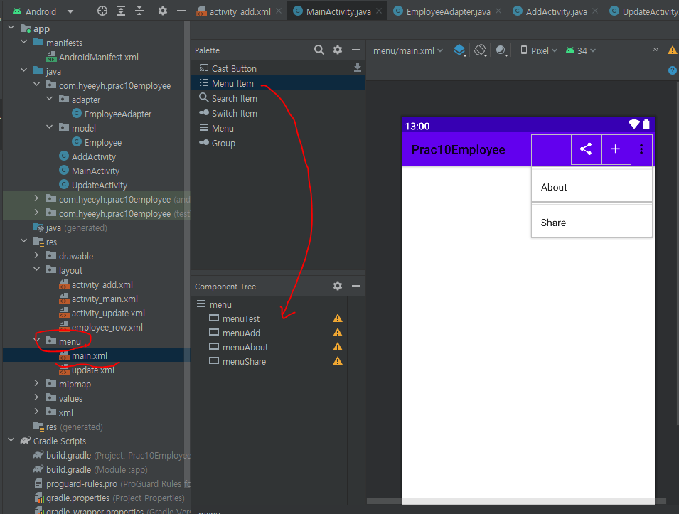
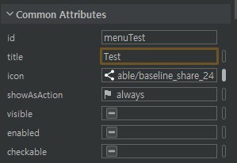

# 7월 17일

## 안드로이드 스튜디오 사용하기 8

### 데이터 받아오기 - 런처
- 다른 액티비티에서 데이터를 받아오는 방법
- 멤버변수와 같은 레벨에 작성해준다 
```
    public ActivityResultLauncher<Intent> launcher =
            registerForActivityResult(new ActivityResultContracts.StartActivityForResult(),
                    //  registerForActivityResult 앞에 new 로 안하는 이유 : 데이터 받아 오는 거라서
            new ActivityResultCallback<ActivityResult>() {
                @Override
                public void onActivityResult(ActivityResult result) {
                    Log.i("Employee MAIN", "onActivityResult");

                    // 5-1.
                    // AddActivity - 데이터 받아 오는 코드
                    if(  result.getResultCode() == 1  ){
                        Log.i("Employee MAIN", "getResultCode()");
                        
                        // 6-1. 로 수정 하면서 삭제 하는 부분
                        // 5-2.
                        // result.getData() --> 인텐트임!
                        //String name = result.getData().getStringExtra("name");
                        //int salary = result.getData().getIntExtra("salary", 0); // 샐러리라는 키값이 없으면 0으로 해라
                        //int age = result.getData().getIntExtra("age", 0); // age라는 키값이 없으면 0으로 해라

                        // 5-2.
                        // 묶음 처리
                        // Employee employee = new Employee(100, name, salary, age); // 아이디값은 없으니까 임시로 넣어줌


                        // 6-1.
                        Employee employee = (Employee) result.getData().getSerializableExtra("employee");


                        // 5-2.
                        // 어레이리스트에 추가
                        employeeArrayList.add(0, employee);

                        // 5-3.
                        // 어댑터에 화면 갱신 명령
                        adapter.notifyDataSetChanged();
                    }
                    
                    else if(result.getResultCode() == 2){
                        
                        // 9-1.
                        // UpdateActivity - 데이터 받아 오기

                        Log.i("AAA", "업데이트 액비티비 데이터 받아옴");

                        Employee employee = (Employee) result.getData().getSerializableExtra("employee");
                        // 9-3.
                        int index = result.getData().getIntExtra("index", 0);
                        
                        // 9-2.
                        // 인덱스 정보 알아야 함. -->> 어댑터 이동
                        employeeArrayList.set(index, employee);

                        // 화면 표시
                        adapter.notifyDataSetChanged();
                        
                    }
                    
                }
            });


        btnAdd.setOnClickListener(new View.OnClickListener() {
            @Override
            public void onClick(View view) {

                Intent intent = new Intent(MainActivity.this, AddActivity.class);
                // 4.
                // startActivity(intent);  //단방향 데이터 보낼때, 또는 데이터 없을때만


                // 5-4.
                // 버튼 눌렀을 때 실행 하는 코드. 위에 런처 작성 했다면 이렇게 명령 내려야 함.
                launcher.launch(intent);
            }
        });

```

### 알러트 다이얼로그 2
```

        // 10-2. 알러트 다이얼로그
        private void showAlertDialog(){
            AlertDialog.Builder builder = new AlertDialog.Builder(context);
            builder.setTitle("정보 삭제");
            builder.setMessage("정말 삭제 하시겠습니까?");
            builder.setNegativeButton("no", null);
            builder.setPositiveButton("yes", new DialogInterface.OnClickListener() {
                @Override
                public void onClick(DialogInterface dialogInterface, int i) {

                    int index = getAdapterPosition();
                    employeeArrayList.remove(index);
                    notifyDataSetChanged();
                }
            });

            builder.show();
        }

```


### 액션 바 수정하기
#### 액션 바 에 타이틀 달기
```
    // 온크리에이트 함수 아래 작성
    // 11. 
    // 액션 바 타이틀 변경 하기
    getSupportActionBar().setTitle("직원 리스트");
```

#### 액션 바에 메뉴 넣기
- 리소스 폴더 오른쪽버튼 - 뉴 - 메뉴 폴더 만들기(안드로이드 리소스 디렉토리 선택)
- 만든 메뉴 폴더 오른쪽버튼 - 뉴 - 메뉴 리소스 파일 - 파일의 이름을 정하고 확인 
- 파일 이름은 보통 연결되는 액티비티의 이름으로 정하는 것이 나중에 확인하기 편하다

#### 액션 바에 메뉴 아이콘 변경
- 리소스 폴더 - 메뉴 폴더 - 바꾸고 싶은 화면으로 이동

- 위에서 메뉴 아이템를 끌어와서 화면에 배치한 다음 
- Common Attribute 에서 아이콘을 선택한 뒤 왼쪽 상단의 플러스 버튼을 눌러 벡터 에셋을 선택하고 원하는 클립아트를 선택해서 아이콘을 만들어 바꾸면 된다.



#### 액션 바에 이전화면으로 돌아가는 화살표 넣기
```
// 온크리에이트 함수 밑에 작성
        // 이전 액티비티로 돌아갈 수 있는 화살표를 표시 하기
        getSupportActionBar().setDisplayHomeAsUpEnabled(true);
```


#### 액션 바와 액티비티 연결
```
// 원하는 액티비티에서 메인함수 바로 아래 작성 

    // 14-3.
    // 액션 바의 화살표 누르면 메인 화면으로 돌아 가기
    @Override
    public boolean onSupportNavigateUp() {
        finish();
        return true;
    }
    
    
    
    // 14-4.
    // 액션 바 - 수정 화면에 메뉴 아이콘 넣기
    @Override
    public boolean onCreateOptionsMenu(Menu menu) {
        getMenuInflater().inflate(R.menu.update, menu);
        return true;
    }

```


