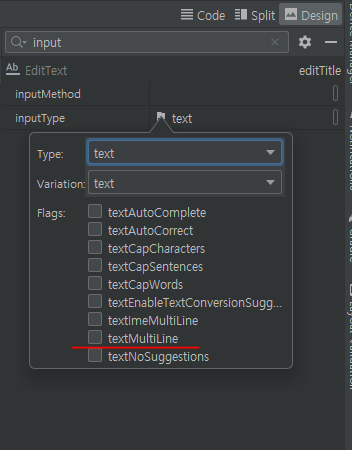

# 7월 18일

## 안드로이드 스튜디오 사용하기 9

### 결과코드를 상수로 만들기
```
public class AddActivity extends AppCompatActivity {

    // 12.
    EditText editTitle;
    EditText editBody;
    Button btnSave;
    
    // 24.
    // 결과코드 상수로 만들기
    public static final int RESULT_ADDACTIVITY_SAVE = 100;
        // static : 데이터 메모리 영역에 생성 되어 다른 액티비티에서도 사용 가능 해짐


	// 13-1.
	// 메인 액티비티로 가져온 데이터를 전달
	Intent intent = new Intent();

	intent.putExtra("post", post);
  	  // 데이터 담기. 포스트라는 키 값으로 위에서 만든 포스트 데이터를 담기

	setResult(RESULT_ADDACTIVITY_SAVE, intent);

```

### 텍스트의 내용을 여러줄로
#### 입력받을떄 5줄까지만 입력받기
#### 화면 기획 파일(XML)

- 일단 인풋타입을 멀티라인으로 해줘야 입력시 엔터가 나온다.
- inputtype : textmultiline 선택
- maxline : 나오는 줄 수 정하기. 1 쓰면 내용이 길어도 1줄만 나옴.
- singleling : 체크 하면 true, false로 해야 여러줄로 입력하는 칸이 보여짐 


### 이미지 처리 라이브러리
- << 참고 >>
- 화면기획 : scaleType : 이미지를 내가 원하는 영역에 맞추고 싶을 때

#### android glide
- 공식 페이지 : 깃허브 https://github.com/bumptech/glide
- 사용방법 : 그래들에 라이브러리 설치하기
    ```
    dependencies {
     implementation 'com.github.bumptech.glide:glide:4.15.1'
    }
    ```

#### 사용하기
```
### 온 크리에이트 함수 밑에 화면 연결 한 후 사용.
### 또는 어댑터 클래스에서 화면 바인드 함수 에서 화면 연결 한 후 사용

        // 글라이드 사용
        // url 주소는 상수처리 가능

        // 한줄로 다 쓰기
        Glide.with(MainActivity.this).load("https://img.freepik.com/free-vector/flat-easter-bunny-collection_23-2149324955.jpg").into(img1);

        // 엔터 쳐서 사용하기
        Glide.with(MainActivity.this)
                .load("https://img.freepik.com/free-photo/cute-ai-generated-cartoon-bunny_23-2150288879.jpg") // - 이미지 주소
                .placeholder(R.drawable.baseline_person_outline_24)// - 네트워크 시간 오래 걸리면 그동안 다른 이미지 보여줘
                // .error(R.id.) //- 에러 떳을 때 이거 보여줘라
                .into(img2); // "이미지아이디"에 넣어라

        Glide.with(MainActivity.this)
                .load("https://image.homeplus.kr/td/e3d4f4c2-00af-45d6-b05d-1ddb4abf737a")
                .into(img3);

```


### 자동으로 연락처, 웹페이지, 이메일 등 띄우기
```
# 메인 액티비티 함수 아래에 만든다.
# 온크리에이트 함수와 같은 레벨에 만든다.


    // +++ 1
    // 연락처 선택 하는 액티비티 띄우기
    // - 핸드폰 연결 해서 앱 설치 알람에 예 를 누르면 설치 되고, 버튼을 누르면 핸드폰의 연락처 앱이 뜬다
    public  void selectContact(){
        Intent intent = new Intent(Intent.ACTION_PICK);

        intent.setType(ContactsContract.Contacts.CONTENT_TYPE);

        startActivity(intent);
    }


    // +++ 2
    // 웹 브라우저 실행 시키는 인텐트
    public void openWebPage(String url){
        Uri uri = Uri.parse(url);
        Intent intent = new Intent(Intent.ACTION_VIEW, uri);
        startActivity(intent);
    }


    // +++ 3
    // sms 보내는 창 띄우기
    void composeSMS(String phone){
        Uri uri = Uri.parse("smsto"+phone);
        Intent intent = new Intent(Intent.ACTION_VIEW, uri);
        startActivity(intent);
    }


    // +++ 4
    // email 보내는 창 띄우기
    void composeEmail(String[] address, String subject){
        Uri uri = Uri.parse("mailto:");
        Intent intent = new Intent(Intent.ACTION_SENDTO);
        intent.setData(uri);
        intent.putExtra(Intent.EXTRA_EMAIL, address);
        intent.putExtra(Intent.EXTRA_SUBJECT, subject);

        startActivity(intent);
    }

```
- (( 참 고 ))
- autolink : 텍스트뷰에 전화번호나 웹페이지, 이메일 주소를 입력하면 자동으로 앱을 띄워서 연결시키는 기능. 전화번호면 연락처 앱을 띄워서 통화 가능하게 만들고, 이메일주소면 메일 앱을 띄워서 메일을 보낼 수 있게 해 줌 


### 유튜브 API 사용하기
#### 유튜브 API 사용하기 전 설정사항
- 구글 콘솔에 애플리케이션 사용 설정 해야함.
- 구글 클라우드 접속 : https://cloud.google.com/?hl=ko
- 콘솔로 이동 클릭
- 클라우드 무료로 사용하기 클릭
- 가입 정보 입력 후 가입하기
-  상단의 프로젝트 클릭
- 새 프로젝트 만들기 클릭
- 새 프로젝트 이름 써주고 만들기 클릭

- 만든 새 프로젝트 이름 클릭
- API 및 서비스 클릭
- 라이브러리 선택 하기
- 선택한 라이브러리 페이지에서 사용 버튼 클릭
- 사용자 인증정보 탭에서 동그라미 친 부분 사용자 인증 정보 만들기 글씨 클릭
- 사용자 인증 정보 만들기를 누르면 알아서 API 키를 만들어준다
- API키가 만들어지면 그 키 이름을 클릭
- API 이름을 원하는 이름으로 바꿔주고
- 사용 제한 탭에서 사용 제한을 선택한 다음
- 원하는 API 사용처에 체크박스를 해주고
- 설정을 저장한다.
- 만들어진 API 키는 키 표시 글자를 클릭하면 다시 볼 수 있다.

#### 

