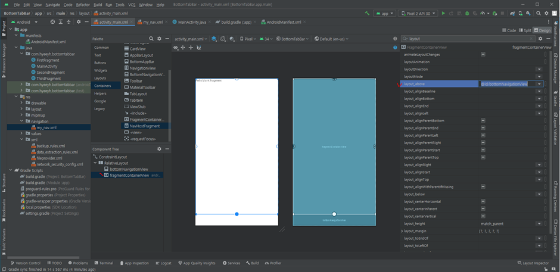

# 7월 25일

## 안드로이드 스튜디오 사용하기 14

### 페이징 처리하기 2
```
# 멤버변수 설정하기
    // 11-5.
    // 페이징 처리에 필요한 변수
    int offset = 0;
    int limit = 10;
    int count= 0;


# 페이징 처리 부분 코드
# 온크리에이트 함수 아래 작성
        // 11-1.
        // 리사이클러뷰와 어댑터 만들고 연결
        recyclerView = findViewById(R.id.recyclerView);
        recyclerView.setHasFixedSize(true);
        recyclerView.setLayoutManager(new LinearLayoutManager(MainActivity.this));


        // 21.
        // 페이징처리 : 리사이클러뷰에 스크롤리스너 설정
        recyclerView.addOnScrollListener(new RecyclerView.OnScrollListener() {
            @Override
            public void onScrollStateChanged(@NonNull RecyclerView recyclerView, int newState) {
                super.onScrollStateChanged(recyclerView, newState);

                int lastPosition = ((LinearLayoutManager)recyclerView.getLayoutManager()).findLastCompletelyVisibleItemPosition();
                int totalCount = recyclerView.getAdapter().getItemCount();

                if(lastPosition+1 == totalCount){
                    // 데이터를 추가로 불러온다
                    if(count == limit){
                        addNetworkData();
                    }

                }
            }
        });


# 페이징 처리에 필요한 데이터 더 가져오는 함수 작성 : addNetworkData();
# 메인 함수 아래 온크리에이트 함수 위 작성.
    // 21-1.
    // 페이징 - 네트워크에서 데이터 더 가져오기
    private void addNetworkData() {
        // 프로그래스바 보이기
        progressBar.setVisibility(View.VISIBLE);

        // 데이터클리어는 처음 데이터를 받아올때만. 여기서는 클리어하면 안됨.

        // 레트로핏
        Retrofit retrofit = NetworkClient.getRetrofitClient(MainActivity.this);
        PostApi api = retrofit.create(PostApi.class);

        // 인증토큰 가져오기
        // 네트워크데이터 가져올때 오프셋에 카운터를 더해서 가져왔음.
        Call<PostList> call = api.getFollowPost(offset, limit, "Bearer "+token );

        call.enqueue(new Callback<PostList>() {
            @Override
            public void onResponse(Call<PostList> call, Response<PostList> response) {
                // 프로그래스 바 없애기
                progressBar.setVisibility(View.GONE);

                if(response.isSuccessful()){
                    PostList postList = response.body();

                    // 페이징처리를 위한 변수 처리
                    count = postList.count;
                    offset = offset + count;

                    postArrayList.addAll( postList.items );

                    // 어댑터에 알려 주기
                    adapter.notifyDataSetChanged();

                }else {

                }
            }


            @Override
            public void onFailure(Call<PostList> call, Throwable t) {
                // 프로그래스 바 없애기
                progressBar.setVisibility(View.GONE);
            }
        });


    }


# 참고 
# 맨 처음 데이터를 가져오는 함수에서 이미 offset과 count를 알아서 올려놓았다.
# 메인 함수 아래, 온크리에이트 함수 위 작성
    // 11-2.
    // 네트워크에서 데이터 가져오는 함수
    private void getNetworkData() {
        
        // 프로그래스바 보이기
        progressBar.setVisibility(View.VISIBLE);
        
        // 먼저 데이터 지우기
        postArrayList.clear();
        
        // 레트로핏
        Retrofit retrofit = NetworkClient.getRetrofitClient(MainActivity.this);
        
        // api 클래스 객체 만들어달라
        // api 있는지 확인 --> posting관련 --> 없다. 만들러가기 : PostApi

        // 11-5.
        PostApi api = retrofit.create(PostApi.class);

        // 인증토큰 가져오기
        // - 아까 토큰 저장된거 확인하면서 한번 가져옴. 위의 토큰을 멤버변수로 만들자
        Call<PostList> call = api.getFollowPost(offset,limit, "Bearer "+token );
        
        call.enqueue(new Callback<PostList>() {
            @Override
            public void onResponse(Call<PostList> call, Response<PostList> response) {
                
                // 프로그래스 바 없애기
                progressBar.setVisibility(View.GONE);

                if(response.isSuccessful()){

                    PostList postList = response.body();

                    // 카운트 수 --> 페이징할때 씀
                    count = postList.count;
                    // 21-2.
                    // 페이징을 위한 변수 처리
                    offset = offset + count;
                    
                    // 받아온 내용 어레이리스트에 추가
                    postArrayList.addAll( postList.items );

                    // 어댑터 객체생성하고 포스트어레이리스트에 추가된 데이터 넣기
                    adapter = new PostAdapter(MainActivity.this, postArrayList);
                    
                    // 리사이클러뷰에 반영해줘
                    recyclerView.setAdapter(adapter);
                    
                }else {

                }
            }

            @Override
            public void onFailure(Call<PostList> call, Throwable t) {

                // 프로그래스 바 없애기
                progressBar.setVisibility(View.GONE);
            }
        }); 
    }

```


### 타임존 변환하기 
```
# 어댑터 클래스의 온바인드뷰 함수 아래

        // todo : 타임 존 바꾸기
        // --> 23-2.sf, df는 멤버변수로 만들어주자 -> 페이징 넘어갈때마다 계속 실행된다.
        //SimpleDateFormat sf = new SimpleDateFormat("yyyy-MM-dd'T'HH:mm:ss");
        //SimpleDateFormat df = new SimpleDateFormat("yyyy년-MM월-dd일 HH:mm");
        //sf.setTimeZone(TimeZone.getTimeZone("UTC"));
        //df.setTimeZone(TimeZone.getDefault());

        // 23-1.
        try {
            Date date = sf.parse(post.createdAt);
            String localTime = df.format(date);
            holder.txtCreatedAt.setText(  localTime  );

        } catch (ParseException e) {
            Log.i("ADAPTERTIME", e.toString());
        }


# 위에서 멤버변수로 만들어 논 버전은 다음과 같다.
    // 멤버변수 부분
    SimpleDateFormat sf;
    SimpleDateFormat df;


    // 10-5.
    public PostAdapter(Context context, ArrayList<Post> postArrayList) {
        this.context = context;
        this.postArrayList = postArrayList;

        // 23-2.
        sf = new SimpleDateFormat("yyyy-MM-dd'T'HH:mm:ss");
        df = new SimpleDateFormat("yyyy년-MM월-dd일 HH:mm");
        sf.setTimeZone(TimeZone.getTimeZone("UTC"));
        df.setTimeZone(TimeZone.getDefault());


        // 23-1.
        try {
            Date date = sf.parse(post.createdAt);
            String localTime = df.format(date);
            holder.txtCreatedAt.setText(  localTime  );

        } catch (ParseException e) {
            Log.i("ADAPTERTIME", e.toString());
    }
    
```


### 레트로핏 사용하기 2
#### Retrofit 에서 Multipart form 으로 데이터를 보내는 방법
```
 # API 생성 클래스
    // 포스트 생성하는 API
    //  @Part MultipartBody.Part photo --> 파일 보낼때
    // @Part("content")RequestBody content --> 내용글 보낼때
    // 응답은 ResultResponse 클래스가 받아준다 -> 없으면 클래스 만들기

    @Multipart
    @POST("/post")
    Call<ResultResponse>addPost(@Header("Authorization") String token,
                                @Part MultipartBody.Part photo,
                                @Part("content")RequestBody content);

    
 # 생성한 API 불러와서 사용하기
 # 온클릭리스너 함수 안에서 작성
    // 29-2.
    Retrofit retrofit = NetworkClient.getRetrofitClient(AddActivity.this);
    // 포스트 생성 API 만들고 돌아오기 --> PostApi 이동
    PostApi api = retrofit.create(PostApi.class);
    
    // 29-3.
    // -- 인증토큰 (헤더에 세팅할 토큰 가져오기)
    SharedPreferences sp = getSharedPreferences(Config.PREFERENCE_NAME, MODE_PRIVATE);
    String token = sp.getString(Config.ACCESS_TOKEN, "");
    
    // 29-4.
    // -- 보낼 파일
        // 사진 파일 가져오기
        // 파라미터 설명 : content 보낼꺼야, (파일을 보낼꺼냐 텍스트를 보낼꺼냐) 파일 중 jpg로 보낼꺼다
    RequestBody fileBody = RequestBody.create(photoFile, MediaType.parse("image/jpg"));
    
        // MultipartBody.Part.createFormData("photo"--> API명세서 바디에있는 폼데이터내용 중 키 값을 넣은것,)
        // 용량이 큰 파일은 잘게 쪼개서 보내는 작업
    MultipartBody.Part photo = MultipartBody.Part.createFormData("photo", photoFile.getName(), fileBody);

    // -- 보낼 텍스트
        // 파라미터 설명 : content 보낼꺼야, (파일을 보낼꺼냐 텍스트를 보낼꺼냐) 텍스트보낼꺼야
    RequestBody textBody = RequestBody.create(content, MediaType.parse("text/plain"));

    // 29-5.
    Call<ResultResponse> call = api.addPost("Bearer "+token, photo, textBody);


    call.enqueue(new Callback<ResultResponse>() {
        @Override
        public void onResponse(Call<ResultResponse> call, Response<ResultResponse> response) {

            // 26.
            // 다이얼로그 없애기
            dismissProgress();


            if(response.isSuccessful()){

                // 25-6.
                // 포스팅성공시 애드액티비티 종료, 메인액티비티 숨어있는거 불러오기
                finish();

            }else {

            }
        }

        @Override
        public void onFailure(Call<ResultResponse> call, Throwable t) {

            // 26.
            // 다이얼로그 없애기
            dismissProgress();

        }
    });
```

### 탭 바 만들기
#### 1. 라이브러리 설치
- 탭 바를 구현해주는 라이브러리를 그래들에 설치
```
// 탭바 구현
    implementation 'androidx.navigation:navigation-fragment:2.5.3'
    implementation 'androidx.navigation:navigation-ui:2.5.3'
```

#### 2. 프래그먼트 화면에 기획
- Fragment : 액티비티 안에서 동작하는것. 네비게이션 바를 만들고 홈버튼을 배치한다고 가정했을때 홈 버튼을 누르면 액티비티가 실행되는게 아니라 프래그먼트만 실행되서 바뀐다. 해당 영역만 바뀌는 것
- res폴더에 네비게이션 폴더 만들기 - 안드로이드 리소스 디렉토리 선택 - 드롭박스에서 네비게이션 선택 - 만든 네비게이션 폴더에서 새 네비게이션 리소스 파일 만들기
- 프래그먼트 만들기 : 다음과 같이 추가한다


- 위 프래그먼트를 만든 다음 다음과 같이 화면을 배치해본다


- 네비게이션 메뉴에도 아이콘을 넣고 싶다면 메뉴 아이템으로 넣어줘야 한다.
- 메뉴 아이템을 배치할 폴더를 만들고 새 메뉴 리소스파일을 만든 뒤 메뉴아이템을 배치하고 아이디, 타이틀, 아이콘 등을 설정 해 준다

##### 메인 액티비티와 메뉴 아이콘 연결
- 네이게이션 뷰를 선택하고 어트리뷰트에 menu를 검색해서 메뉴 칸 가장 오른쪽에 긴 위아래타원모양의 버튼을 눌러 메뉴 만든것을 불러온다.


# 오늘의 문제점 및 해결방안
### 1. 포스팅 앱의 리스트를 보여주는 부분에서 오류
- 사진과 내용을 보여주는 포스팅 앱을 만드는 도중, 모든 포스트에서 사진이 나오지 않음.
    ```
    # 에러 로그
    class com.bumptech.glide.load.engine.GlideException: Failed to load resource
    ```
- 코드, 버킷, API 모두 정상 동작하는 것을 확인.
- 알고보니 앱 서버를 파이썬으로 만들 때 S3 버킷에 자동으로 할당되는 http주소에 문제가 있음을 발견.
### 1.의 해결 방안
- 서버 앱 파일의 Config.py 내용을 다음과 같이 수정
    ```
    # S3 관련 변수
        S3_BUCKET = '******-post-app-us'
        S3_BASE_URL = 'https://'+S3_BUCKET+'.s3.amazonaws.com/'

    ```
- http:// 라고 시작하는 이미지 주소가 문제였다.
- 보안을 위해 https:// 라고 주소를 써야했는데 http://라고 주소가 들어간 것이 문제였음.
- AWS의 S3의 해당 버킷의 속성부분에 객체URL을 확인 --> https:// 라고 주소가 시작하는 것을 확인 할 수 있음.
- 데이터베이스에 객체를 저장할 때에 주소는 이 부분이 일치해야만 오류가 나지 않는다.
- MySQL 워크밴치에서 저장된 이미지 주소의 앞부분을 전부 https:// 로 바꾸고 나서 안드로이드앱을 실행하니 제대로 이미지가 표시되는 것을 확인
- 이후 PostMan으로 테스트 한 포스팅에서도 이미지가 제대로 표시된 것을 확인함.
## 언제나 항상 오타와 띄어쓰기가 문제이다. 천천히 만들고 유닛테스트를 여러번 하자!

### 2. 탭 바 라이브러리 오류
- 안드로이드 프로젝트로 탭 바를 만들면서 유닛테스트를 했는데 이상한 오류가 뜸
    ```
    # 오류 코드
    Duplicate class kotlin.collections.jdk8.CollectionsJDK8Kt found in modules kotlin-stdlib-1.8.20 (org.jetbrains.kotlin:kotlin-stdlib:1.8.20) and kotlin-stdlib-jdk8-1.6.21 (org.jetbrains.kotlin:kotlin-stdlib-jdk8:1.6.21)
    Duplicate class kotlin.internal.jdk7.JDK7PlatformImplementations found in modules kotlin-stdlib-1.8.20 (org.jetbrains.kotlin:kotlin-stdlib:1.8.20) and kotlin-stdlib-jdk7-1.6.21 (org.jetbrains.kotlin:kotlin-stdlib-jdk7:1.6.21)
    Duplicate class kotlin.internal.jdk7.JDK7PlatformImplementations$ReflectSdkVersion found in modules kotlin-stdlib-1.8.20 (org.jetbrains.kotlin:kotlin-stdlib:1.8.20) and kotlin-stdlib-jdk7-1.6.21 (org.jetbrains.kotlin:kotlin-stdlib-jdk7:1.6.21)
    Duplicate class kotlin.internal.jdk8.JDK8PlatformImplementations found in modules kotlin-stdlib-1.8.20 (org.jetbrains.kotlin:kotlin-stdlib:1.8.20) and kotlin-stdlib-jdk8-1.6.21 (org.jetbrains.kotlin:kotlin-stdlib-jdk8:1.6.21)
    .
    .
    .
    .

    Go to the documentation to learn how to Fix dependency resolution errors.
    ```
- 라이브러리의 버전 문제
#### 2. 의 해결방법
- 라이브러리 버전을 2.6.0 --> 2.5.3 으로 바꾸고 난 후 실행 잘 됨


