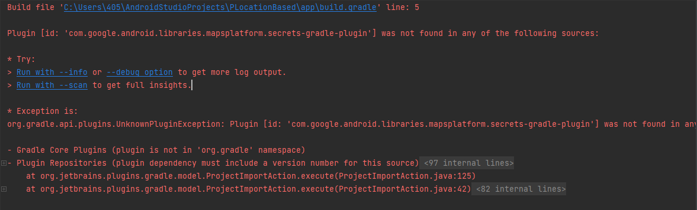

# 7월 26일

## 안드로이드 스튜디오 사용하기 15

### 탭 바 구현하기 2

#### 프래그먼트 작동하게 만들기
- 프래그먼트는 액티비티 안에서 동작하는 화면! 액티비티가 넘어가는게 아니다.
- 
- 첫번째 프래그먼트 자바 파일
- 첫번째 프래그먼트 화면에 관한 동작을 담당하는 자바 파일임.
- 보통 온크리에이트뷰 함수만 수정. 윗 부분의 코드는 잘 건들이지 않는다!
- 
- 온크리에이트 뷰 : 화면이 만들어질 때 실행되는 코드

- 메인액티비티는 프래그먼트를 바꿔주기만 하는 역할을 하고 
- 동작은 프래그먼트에서 다 한다.
- 고로 한번 잘 만들어놓고 나중에 복붙해서 사용하면 된다!
- 이 코드를 한번 작성하고 나면 메인액티비티의 코드는 복붙해서 사용하기만 하면 된다.
    ```
    # 메인 액티비티 

    package com.hyeeyh.bottomtabbar;

    import androidx.annotation.NonNull;
    import androidx.appcompat.app.AppCompatActivity;
    import androidx.fragment.app.Fragment;

    import android.os.Bundle;
    import android.view.MenuItem;

    import com.google.android.material.bottomnavigation.BottomNavigationView;
    import com.google.android.material.navigation.NavigationBarView;


    // 0.
    //-화면 기획하고 돌아옴


    // -- -- -- 메인액티비티는 프래그먼트를 바꿔주기만 하는 역할을 하고 
    // -- -- -- 동작은 프래그먼트에서 다 한다.
    // -- -- -- 고로 한번 잘 만들어놓고 나중에 복붙해서 사용하면 된다!


    public class MainActivity extends AppCompatActivity {


        // 1.
        BottomNavigationView bottomNavigationView;

        // 1-1. 각 프레그먼트들을 멤버변수로 만든다.
        Fragment firstFragment;
        Fragment secondFragment;
        Fragment thirdFragment;


        @Override
        protected void onCreate(Bundle savedInstanceState) {
            super.onCreate(savedInstanceState);
            setContentView(R.layout.activity_main);

            // 3.
            // 액션바 타이틀 바꾸기
            getSupportActionBar().setTitle("홈");


            // 2.
            bottomNavigationView = findViewById(R.id.bottomNavigationView);

            // 2-6.
            // 객체 생성
            firstFragment = new FirstFragment();
            secondFragment = new SecondFragment();
            thirdFragment = new ThirdFragment();


            // 2-1.
            // 네비게이션바를 눌렀을 때
            bottomNavigationView.setOnItemSelectedListener(new NavigationBarView.OnItemSelectedListener() {
                @Override
                public boolean onNavigationItemSelected(@NonNull MenuItem item) {

                    // 2-2.
                    // 유저가 누른 아이템이 뭔지 가져오기 --> 메뉴화면에 아이템 아이디 있음.
                    int itemId = item.getItemId();

                    // 2-3.
                    Fragment fragment = null;

                    // 2-3.
                    // if문
                    if(itemId == R.id.firstFragment){
                        // -첫번째 메뉴 아이콘을 누르면 첫번째 프래그먼트를 메인화면으로 하겠다
                        fragment = firstFragment;
                        
                        // 3-1. 액션 바 타이틀 바꾸기
                        getSupportActionBar().setTitle("홈");


                    }else if(itemId == R.id.secondFragment){
                        // -두번째 메뉴 아이콘을 누르면 두번째 프래그먼트를 메인화면으로 하겠다
                        fragment = secondFragment;

                        // 3-1. 액션 바 타이틀 바꾸기
                        getSupportActionBar().setTitle("내 포스트");


                        
                    }else if(itemId == R.id.thirdFragment){
                        // -세번째 메뉴 아이콘을 누르면 세번째 프래그먼트를 메인화면으로 하겠다
                        fragment = thirdFragment;

                        // 3-1. 액션 바 타이틀 바꾸기
                        getSupportActionBar().setTitle("설정");

                    }

                    // 2-5.
                    // -아래에서 만든 함수 불러옴
                    return loadFragment(fragment);
                }
            });


        } // 온크리에이트 닫음


        // 2-4.
        // 프래그먼트 화면 전환을 위한 코드
        boolean loadFragment(Fragment fragment){
            if(fragment != null){
                // 프래그먼트 담당 매니저를 불러서, 메인액티비티의 프래그먼트 영역을 바꿔라, 위에서 받은 함수의 파라미터로 (유저가 선택한 프래그먼트로)
                getSupportFragmentManager()
                        .beginTransaction()
                        .replace(R.id.fragment, fragment)
                        .commit();
                return true;
            }
            else{
                // - 이 경우에는 화면이 이상한 경우
                return false;
            }
        }


    } // 메인 닫음

    ```

### 위치정보 GPS 기능
- 이 기능을 사용하기 위해서는 권한이 두개가 추가되어야 한다.
- 안드로이드 스튜디오 프로젝트 - 매니페스트 에 권한 추가
- 눈에 잘 띄게 어플리케이션 위쪽 공간에 써준다
    ```
    <uses-permission android:name="android.permission.ACCESS_FINE_LOCATION"/>
    <uses-permission android:name="android.permission.ACCESS_COARSE_LOCATION"/>
    ```

#### GPS 동작 코드
- 매뉴얼 대로 작성하면 된다.
```
public class MainActivity extends AppCompatActivity {

    // 1.
    // 매니페스트에 권한 설정하고 옴
    //    <uses-permission android:name="android.permission.ACCESS_FINE_LOCATION"/>
    //    <uses-permission android:name="android.permission.ACCESS_COARSE_LOCATION"/>

    // 2.
    LocationManager locationManager;
    LocationListener locationListener;


    @Override
    protected void onCreate(Bundle savedInstanceState) {
        super.onCreate(savedInstanceState);
        setContentView(R.layout.activity_main);

        // 3.
        // 핸드폰의 위치를 가져오기 위해서는 시스템서비스로부터 로케이션 매니저를 받아온다
        // --> 빨간줄 뜨면 캐스트 하기
        locationManager = (LocationManager) getSystemService(LOCATION_SERVICE);

        // 3-1.
        // 로케이션 리스너를 만든다
        locationListener = new LocationListener() {
            @Override
            public void onLocationChanged(@NonNull Location location) {
                // 이동해서 위치가 변하면 그때마다 실행된다
                // 여기에 로직을 작성한다
                // -- 예시 : 위치가 바뀌면 알람소리를 내겠다, 위도와경도의 정보를 표시하겠다...

                // - (@NonNull Location location) 의 location에 위도와 경도의 정보가 있음.
                // 위도 가져오는 코드
                // location.getLatitude();
                // 경도 가져오는 코드
                // location.getLongitude()

                Log.i("myLocation", "위도 : "+location.getLatitude());
                Log.i("myLocation", "경도 : "+location.getLongitude());
            }
        };

        // 3-2. 위치 정보 허용 요청하기 (매뉴얼)
        if(ActivityCompat.checkSelfPermission(
                MainActivity.this,
                Manifest.permission.ACCESS_FINE_LOCATION)
                != PackageManager.PERMISSION_GRANTED){

                // 3-2. 위치기반서비스 사용하겠다고 허용 안했다면 허용 해 달라고 요청한다.
            ActivityCompat.requestPermissions(
                    MainActivity.this,
                    new String[]{Manifest.permission.ACCESS_FINE_LOCATION,
                            Manifest.permission.ACCESS_COARSE_LOCATION},
                    100);
            return;
        }

        // 위치기반을 허용하였으므로
        // 로케이션 매니저에 리스너를 연결한다.
        // 파라미터 설명
        // - LocationManager.GPS_PROVIDER : 위치 정보 확인
        // - 숫자 : 몇초에 한번씩 위치를 파악하는가 (1000 = 1초)
        // - 숫자 : 미터. 몇 미터 갈때마다 파악하는가? (미터단위) : 마이너스라면 위치 안 재고, 설정한 초 마다 위치 파악
        // - : 몇초마다 또는 몇 미터마다 움직였을때 어떤 코드를 사용할까?
        locationManager.requestLocationUpdates(LocationManager.GPS_PROVIDER, 3000, -1, locationListener);

    } // 온크리에이트 닫음


    // 4.
    // 3-2 에서 연결
    // 위치기반 서비스 권한 허용했는지 
    @Override
    public void onRequestPermissionsResult(int requestCode, @NonNull String[] permissions, @NonNull int[] grantResults) {
        super.onRequestPermissionsResult(requestCode, permissions, grantResults);

        // 위치기반 허용하겠다 했다면 --> 다시한번 허용했는지 확인
        if (requestCode == 100) {

            if (ActivityCompat.checkSelfPermission(
                    MainActivity.this,
                    Manifest.permission.ACCESS_FINE_LOCATION)
                    != PackageManager.PERMISSION_GRANTED) {

                // 3-2. 위치기반서비스 사용하겠다고 허용 안했다면 허용 해 달라고 요청한다.
                ActivityCompat.requestPermissions(
                        MainActivity.this,
                        new String[]{Manifest.permission.ACCESS_FINE_LOCATION,
                                Manifest.permission.ACCESS_COARSE_LOCATION},
                        100);
                return;
            }

            // 위치기반을 허용하였으므로
            // 로케이션 매니저에 리스너를 연결한다.
            // 파라미터 설명
            // - LocationManager.GPS_PROVIDER : 위치 정보 확인
            // - 숫자 : 몇초에 한번씩 위치를 파악하는가 (1000 = 1초)
            // - 숫자 : 미터. 몇 미터 갈때마다 파악하는가? (미터단위) : 마이너스라면 위치 안 재고 설정한 초 마다 위치 파악
            // - : 몇초마다 또는 몇 미터마다 움직였을때 어떤 코드를 사용할까?
            locationManager.requestLocationUpdates(LocationManager.GPS_PROVIDER, 3000, -1, locationListener);

        }
    }

}
```

### 구글 지도 앱에 추가하기
#### 지도 기능 추가 하기 전 설정 세팅하기
- 구글에서 배포한 사용설명서 보고 추가
- 설명서 : https://developers.google.com/maps/documentation/android-sdk/config?hl=ko

##### 구글 클라우드폼에서 API 만들기
- 구글 클라우드폼 콘솔로 이동 : https://cloud.google.com/?hl=ko
- 로그인 후 API를 추가할 프로젝트로 이동 또는 프로젝트 추가
- 프로젝트를 선택한 후 왼쪽 메뉴 바에서 'API 및 서비스' - '라이브러리' 선택
- 검색하면 Maps SDK for Android 라는 라이브러리를 클릭 해 '사용' 버튼을 누름
- 사용 버튼을 누르면 API를 생성 해 줌.
- 애플리케이션 제한사항 설정은 안해도 됨
- API 제한사항에서 키 제한을 선택한 다음 Maps SDK for Android를 선택해 주면 됨.
- ---> 새 키를 만들어도 되지만 기존 키에서 API 키 제한을 선택해 Maps SDK for Android를 추가 해도 된다.


##### 그래들에 라이브러리 추가하기
- 그래들(프로젝트)
    ```
    // 플러그 인 안에 추가
    id 'com.google.android.libraries.mapsplatform.secrets-gradle-plugin' version '2.0.1' apply false

    ```

- 그래들(모듈)
    ```
    // 플러그 인 안에 추가
    id 'com.google.android.libraries.mapsplatform.secrets-gradle-plugin'
    // 디펜던시 안에 추가
    implementation 'com.google.android.gms:play-services-maps:18.1.0'
    ```

- 그래들 폴더 - local.properties 파일에 추가
    ```
    MAPS_API_KEY= "구글 클라우드폼에서 만든 구글 맵 용 API 키"
    ```

##### 매니페스트 권한 추가
- 매니페스트 파일에 권한 추가해주기
    ```
    // 어플리케이션 위쪽 어플리케이션과 같은 레벨에 권한 추가
    <uses-permission android:name="android.permission.ACCESS_FINE_LOCATION"/>
    <uses-permission android:name="android.permission.ACCESS_COARSE_LOCATION"/>
    <uses-permission
        android:name="android.permission.WRITE_EXTERNAL_STORAGE" />


    액티비티와 어플리케이션 사이에 추가
    <meta-data
        android:name="com.google.android.geo.API_KEY"
        android:value="${MAPS_API_KEY}" />

    <meta-data
        android:name="com.google.android.gms.version"
        android:value="@integer/google_play_services_version" />
    ```


#### 코드 작성
```
@Override
    protected void onCreate(Bundle savedInstanceState) {
        super.onCreate(savedInstanceState);
        setContentView(R.layout.activity_main);

        // 1.
        SupportMapFragment mapFragment =
                (SupportMapFragment) getSupportFragmentManager().findFragmentById(R.id.map);


        // 2. 지도 세팅
        mapFragment.getMapAsync(new OnMapReadyCallback() {
            @Override
            public void onMapReady(@NonNull GoogleMap googleMap) {
                // 맵이 (준비되면) 화면에 나타나는 부분
                // 여기에 로직을 작성
                // - (@NonNull GoogleMap googleMap) 의 파라미터인 googleMap에 지도가 있음.
                
                // 내가 정한 위치로 지도 표시! --> 위도, 경도값 : 학원 위치로 설정하기
                LatLng myLocation = new LatLng(37.5429, 126.6772);
                
                // 지도의 중심을 내가 정한 위치로 세팅
                //googleMap.moveCamera(CameraUpdateFactory.newLatLng(myLocation));
                
                // 줌 레벨 까지 설정(내가 정한 위치의)
                googleMap.moveCamera(CameraUpdateFactory.newLatLngZoom(myLocation, 17));
                
                
                
                // 마커를 만들어 지도에 표시 + 타이틀도 설정하기
                MarkerOptions markerOptions = new MarkerOptions();
                markerOptions.position(myLocation).title("연희직업전문학교");

                googleMap.addMarker(markerOptions).setTag(0); // setTag(0) : 마커클릭했을때 처리하기 위해 태그 추가

                // 마커를 표시하는 코드를 한줄로 쓰기
                // -myLocation 변수에 저장되어있는 위도 경도 말고 다른 위도 경도를 쓴다.
                googleMap.addMarker(new MarkerOptions().position(new LatLng(37.5438, 126.6772)).title("마커2")).setTag(1);

                // 마커 3
                // -myLocation 변수에 저장되어있는 위도 경도 말고 다른 위도 경도를 쓴다.
                MarkerOptions markerOptions1 = new MarkerOptions();
                markerOptions1.position(new LatLng(37.5428, 126.6762)).title("마커3");
                googleMap.addMarker(markerOptions1).setTag(2);

                
                
                // 마커를 클릭했을 때 처리하는 코드
                googleMap.setOnMarkerClickListener(new GoogleMap.OnMarkerClickListener() {
                    @Override
                    public boolean onMarkerClick(@NonNull Marker marker) {
                        // 마커를 클릭했을 때 로직 작성


                        // 클릭 된 태그 값 가져오기
                        int tag = (int) marker.getTag();
                        
                        // 조건문으로 마커 별 처리
                        //if(tag == 0){

                        //}else if(tag ==1){

                        //}


                        Toast.makeText(MainActivity.this,
                                marker.getTitle()+" 입니다.",
                                Toast.LENGTH_SHORT).show();


                        return false;
                    }
                });


                // 지도의 타입을 설정 할 수 있다.
                // .MAP_TYPE_SATELLITE  --> 이 부분을 바꿔보면 된다.
                googleMap.setMapType(GoogleMap.MAP_TYPE_SATELLITE);


            }
        });


    }
```


# 오늘의 문제점 및 해결방안
### 1. 문제점
- 구글의 지도 기능을 앱에서 사용하기 위해 라이브러리를 추가하는 도중 다음과 같은 에러가 뜸
```
Build file 'C:\Users\405\AndroidStudioProjects\PLocationBased\app\build.gradle' line: 5

Plugin [id: 'com.google.android.libraries.mapsplatform.secrets-gradle-plugin'] was not found in any of the following sources:
```


### 1. 의 해결방안
- 라이브러리를 추가한 파일은 그래들(모듈:앱)파일인데 여기에만 라이브러리를 세팅하고 싱크를 눌러서 문제가 됨.
- 그래들(프로젝트)에 아이디를 추가하고 나서 그래들(모듈)에 라이브러리를 추가해야 오류가 나지 않음. 또는 두 군데 다 라이브러리를 추가하고 한꺼번에 싱크를 눌러야 오류가 없어짐.


