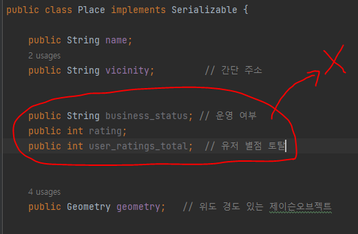

# 7월 27일

## 안드로이드 스튜디오 16

### 지도 실습 개발하기
- 배운 지도와 GPS 기능을 이용해 간단한 지도 검색 앱 만들기

# 오늘의 문제점 및 해결방안

### 1. 문제점
- 지도 앱을 완성 후 애뮬레이터로 실행을 시키면, 데이터는 받아오지만 화면에 표시가 되지 않는 문제
- 로그에는 데이터 받아오는 것이 찍히지만, 화면의 리사이클러뷰에는 뜨지 않았다

### 1. 의 해결방안
- 알고보니 데이터를 받아서 저장하는 클래스에서 안쓰는 변수를 저장 해 놔서 생기는 문제였음.
- 데이터를 저장하는 클래스마다 implements Serializable 를 붙여 순서대로 들어가게 만들어놨는데
- 순서대로 들어가다 보니 안쓰는 변수에 데이터가 들어가 오류가 생기는 것 이었음.
- 안 쓰는 변수들을 지워주니 제대로 실행이 됨.

- 1.의 문제는 애뮬레이터의 지도를 현재 위치로 설정하지 않고 실행을 해도 문제가 발생 할 수 있으니
- 애뮬레이터에서 지도 위치를 설정 한 후 사용해야 한다.

